# Домашнее задание по теме "Основы Git" Ячмень Марк Викторович


## Задание 1. Создать и настроить репозиторий для дальнейшей работы на курсе

Полный текст задания можно посмотреть [в репозитории Netology](https://github.com/netology-code/sysadm-homeworks/blob/devsys10/02-git-02-base/README.md#%D0%B7%D0%B0%D0%B4%D0%B0%D0%BD%D0%B8%D0%B5-1-%D0%B7%D0%BD%D0%B0%D0%BA%D0%BE%D0%BC%D0%B8%D0%BC%D1%81%D1%8F-%D1%81-gitlab-%D0%B8-bitbucket).


## Решение 1

### GitLab

Для выполнения задания выполним следующие действия.

Аутентифицируемся на сайте https://gitlab.com/ с помощью учётной записи Google и приступим к созданию нового проекта.

В форме создания нового проекта введём требуемые по заданию значения:

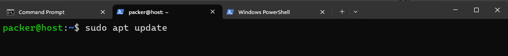

и нажмём кнопку **Create project**.

Выполним команду ```git remote -v```:

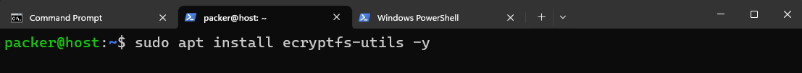

В выводе мы видим, что сейчас в Git подключен репозиторий с Github.

Для подключения второго удалённого репозитория с GitLab выполним команду ```git remote add gitlab https://gitlab.com/m.yachmen/devops-netology.git```.
Для проверки добавления нового репозитория снова выполним команду ```git remote -v```:

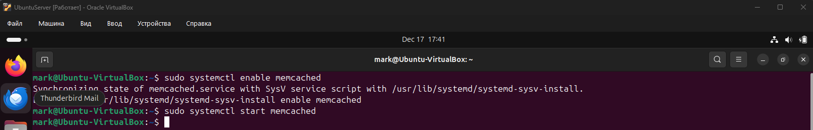

Отправим изменения в новый удалённый репозиторий выполнив команду ```git push -u gitlab main```.
Консоль Git запросит аутентификацию на GitLab:

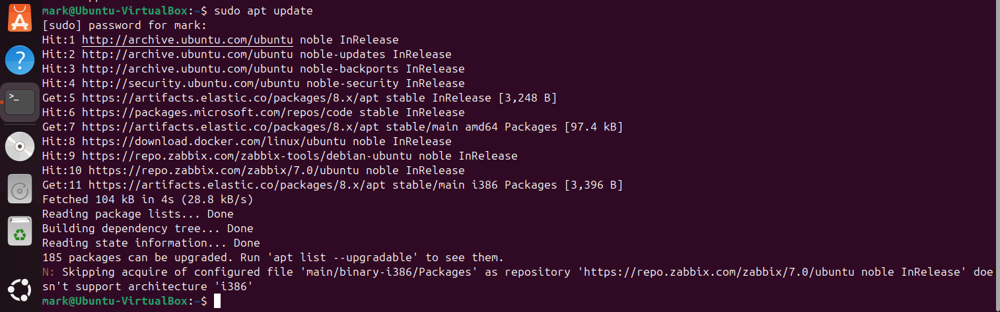

После этого данные из локального репозитория будут переданы в репозиторий на GitLab:

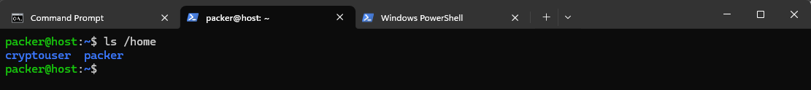

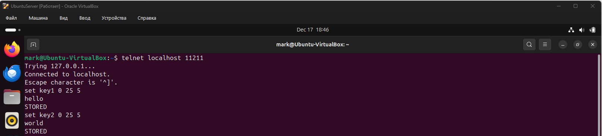


## Задание 2. Теги

Полный текст задания можно посмотреть [в репозитории Netology](https://github.com/netology-code/sysadm-homeworks/blob/devsys10/02-git-02-base/README.md#%D0%B7%D0%B0%D0%B4%D0%B0%D0%BD%D0%B8%D0%B5-2-%D1%82%D0%B5%D0%B3%D0%B8).

## Решение 2

Создадим легковестный(lightweight) тег ```v0.0```. Для этого выполним команду ```git tag v0.0```:

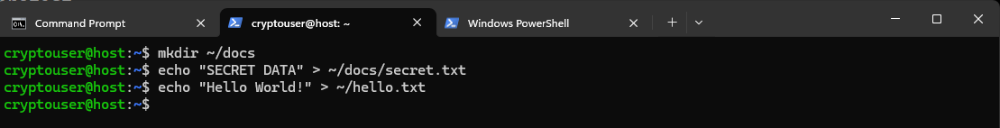

Эта команда создаст простой тег без дополнительной информации.

Для проверки того, что тег появился, выполним команду ```git tag```:

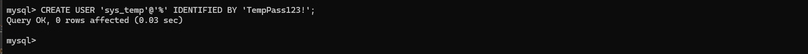

Для отправки тега во все удалённые репозитории выполним команды ```git push origin v0.0``` и ```git push gitlab v0.0```:

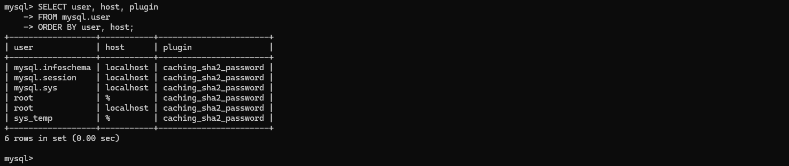

Создадим аннотированный тег ```v0.1```. Для этого выполним команду ```git tag -a v0.1 -m "Version 0.1"```:

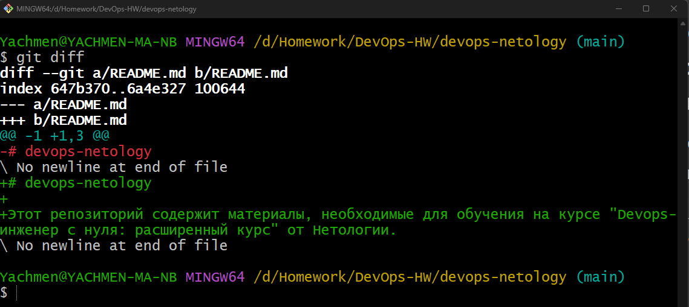

Этот тег уже содержит:

 - автора

 - дату

 - описание
 
Для проверки информации о теге выполним команду ```git show v0.1```:

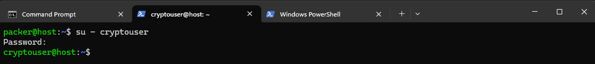

Для отправки второго тега в удалённые репозитории выполним команды ```git push origin v0.1``` и ```git push gitlab v0.1```:

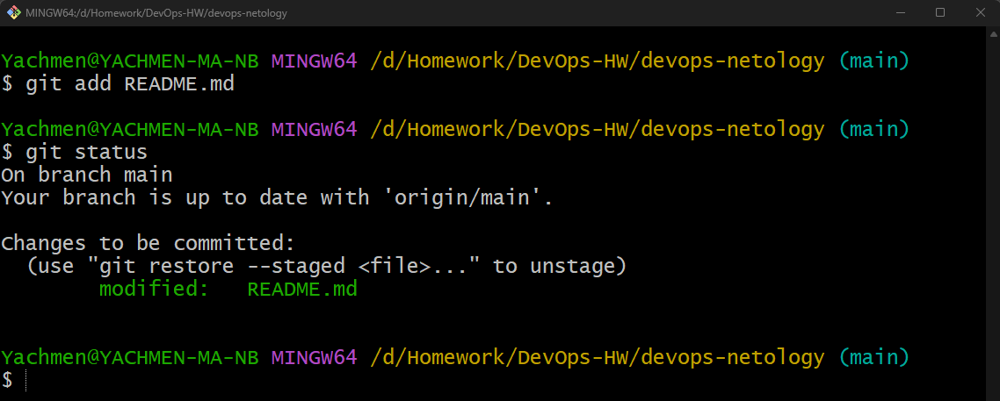

Для того, чтобы проверить теги на сайтах перейдём в соответствующие разделы на GitLab и Github:

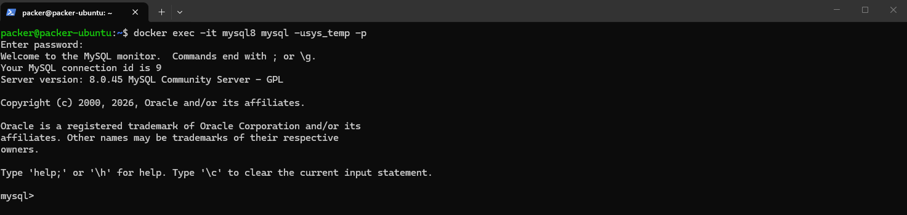

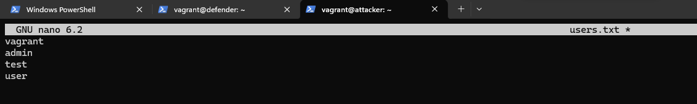


## Задание 3. Ветки

Полный текст задания можно посмотреть [в репозитории Netology](https://github.com/netology-code/sysadm-homeworks/blob/devsys10/02-git-02-base/README.md#%D0%B7%D0%B0%D0%B4%D0%B0%D0%BD%D0%B8%D0%B5-3-%D0%B2%D0%B5%D1%82%D0%BA%D0%B8).

## Решение 3

Для проверки с каким удалённым репозиторием сейчас связана ветка main выполним команду ```git branch -vv```:

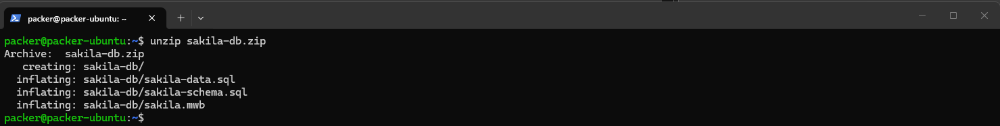

Из вывода мы видим, что main сейчас связана с репозиторием на GitLab.
Для переключения main на Github выполним команду ``` git branch --set-upstream-to=origin/main main```:

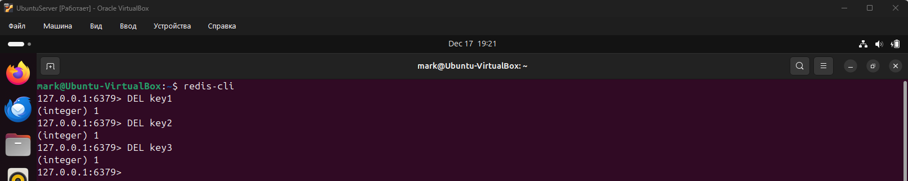

Для проверки переключения снова выполним команду ```git branch -vv```:

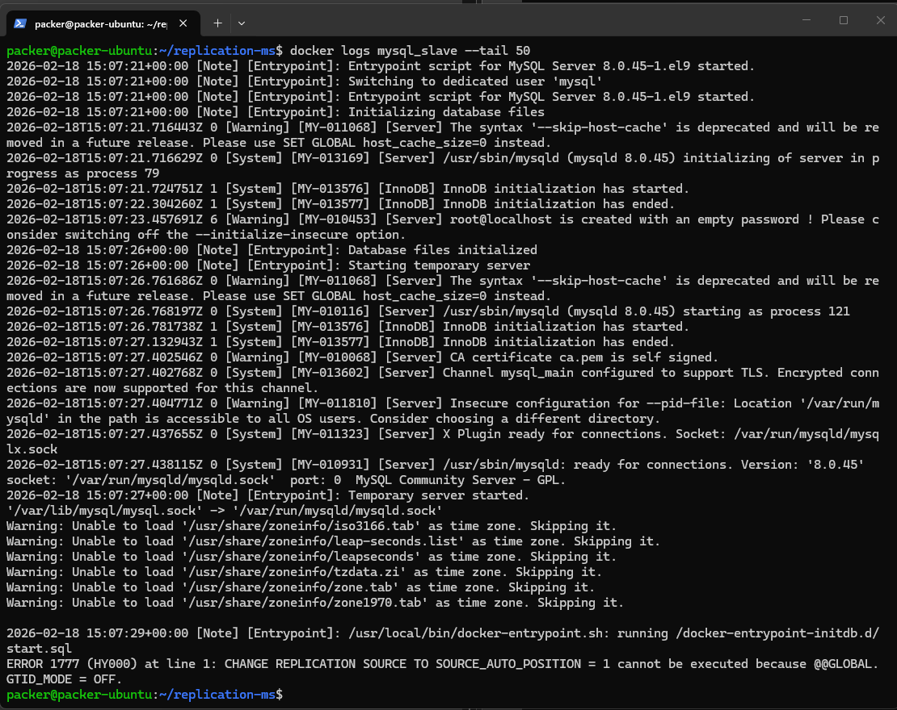

Для поиска хеша коммита ```Prepare to delete and move``` выполним команду ```git log --oneline```:

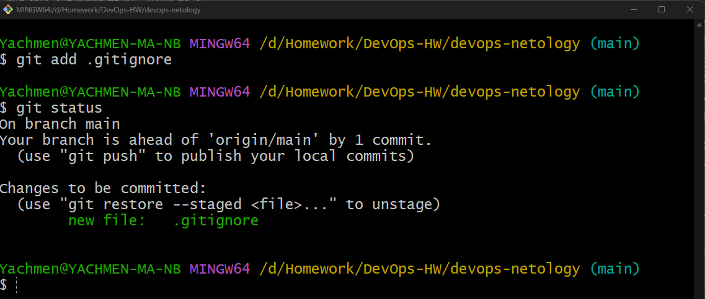

Перейдём на этот коммит выполнив команду ```git checkout ХЕШ_КОММИТА```:

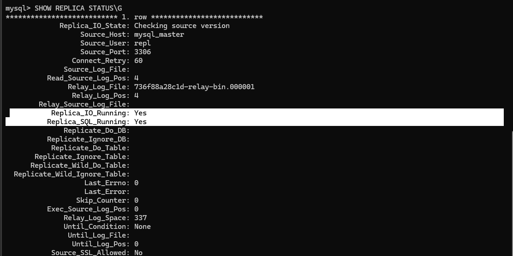

Для того, чтобы создать от этого коммита новую ветку ```fix``` выполним команду ```git switch -c fix```:

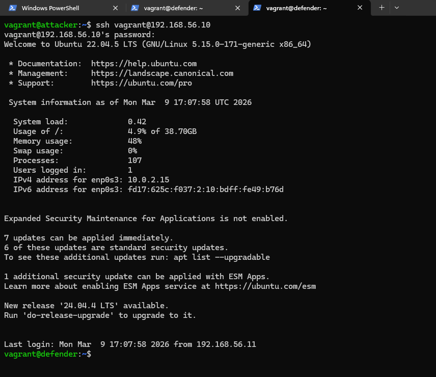

Для отправки ветки ```fix``` в удалённый репозиторий на Github выполним команду ```git push -u origin fix```:

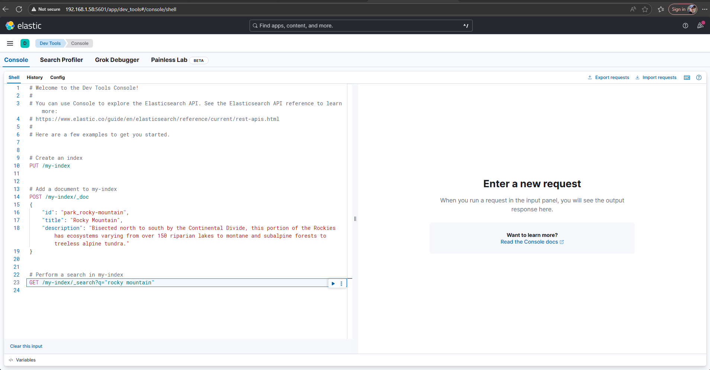

Для проверки снова выполним команду ```git branch -vv```:

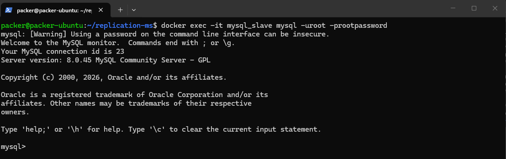

Для визуального просмотра схемы коммитов перейдём в раздел Network на сайте Github:

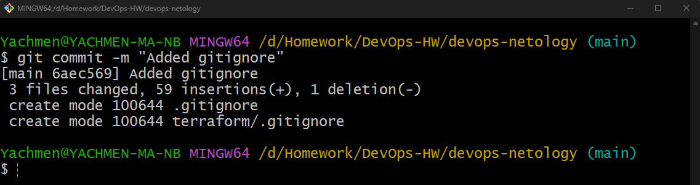

Находясь в ветке ```fix``` добавим в файл README.md новую строку, сохраним файл и закоммитим изменения.
Для этого выполним команды ```git add README.md``` и ```git commit -m "Add note to README in fix branch"```:

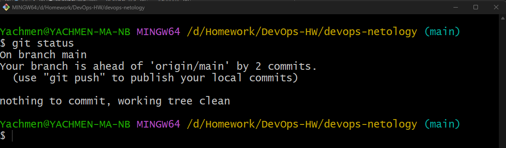

Для отправки изменений на Github выполним команду ```git push```:

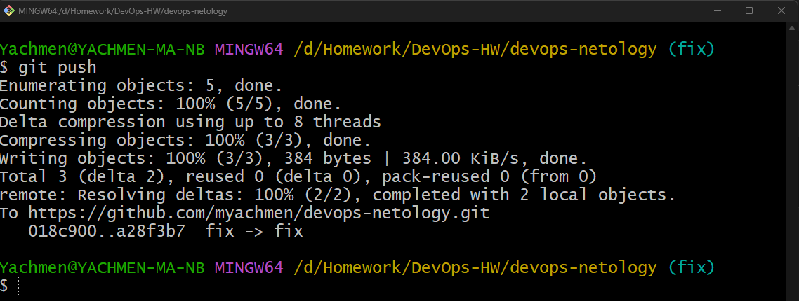

На сайте Github в разделе Network посмотрим, как изменилась схема коммитов:

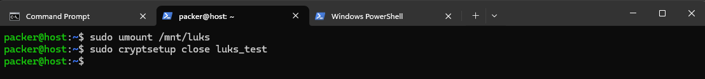

Изменения так же можно увидеть в консоли выполнив команду ```git log --oneline --graph --decorate --all```:

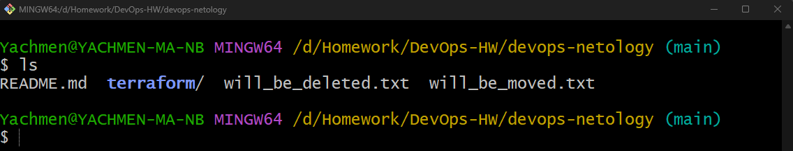


## Задание 4. Упрощаем себе жизнь

Полный текст задания можно посмотреть [в репозитории Netology](https://github.com/netology-code/sysadm-homeworks/blob/devsys10/02-git-02-base/README.md#%D0%B7%D0%B0%D0%B4%D0%B0%D0%BD%D0%B8%D0%B5-4-%D1%83%D0%BF%D1%80%D0%BE%D1%89%D0%B0%D0%B5%D0%BC-%D1%81%D0%B5%D0%B1%D0%B5-%D0%B6%D0%B8%D0%B7%D0%BD%D1%8C).

## Решение 4