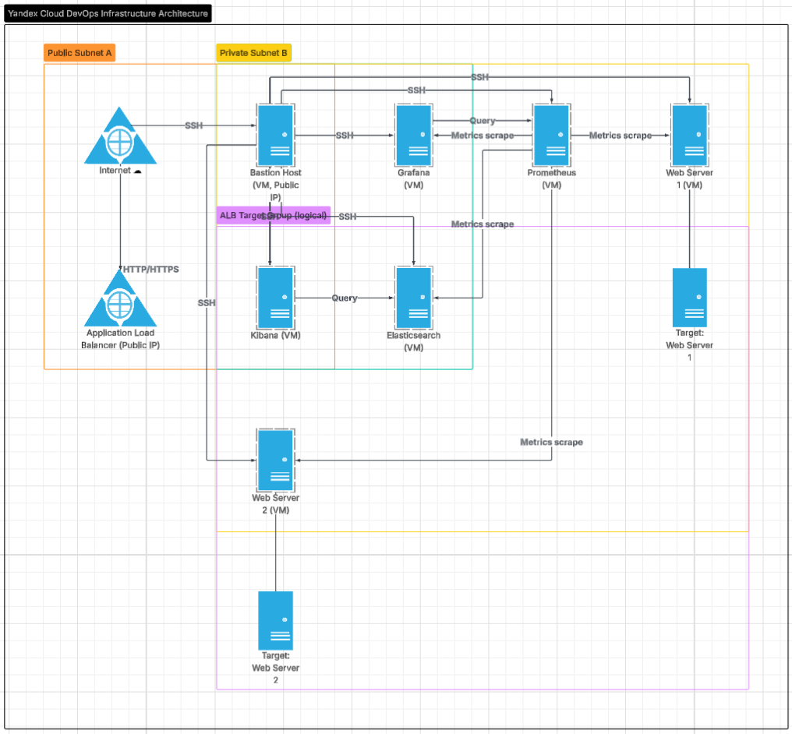
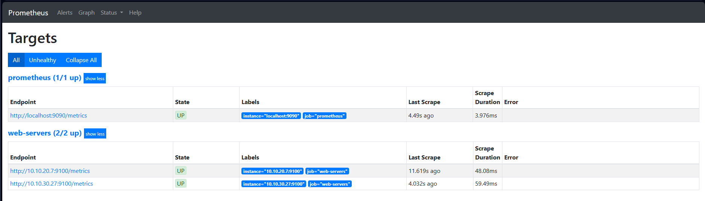
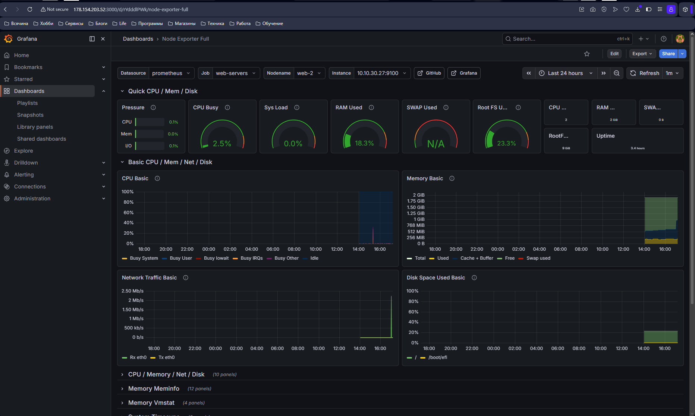
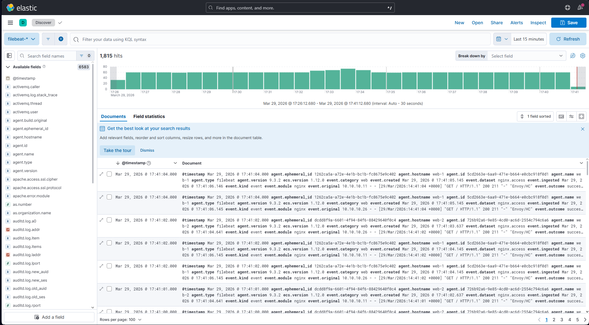

# Курсовой проект проект DevOps  
## Автоматизированное развёртывание инфраструктуры в Yandex Cloud

---

# О проекте

В рамках курсового проекта реализована полноценная облачная инфраструктура в **Yandex Cloud**, включающая:

- развёртывание инфраструктуры через **Terraform**
- конфигурацию серверов через **Ansible**
- балансировку нагрузки через **Application Load Balancer**
- мониторинг системы (**Prometheus + Grafana**)
- централизованное логирование (**Elasticsearch + Kibana**)
- автоматическое резервное копирование виртуальных машин

Проект реализован с применением принципов:

- Infrastructure as Code (IaC)
- автоматизации конфигурации
- отказоустойчивости
- централизованного мониторинга

---

# Используемые технологии

| Компонент | Назначение |
|-----------|-------------|
| Terraform | Развёртывание инфраструктуры |
| Ansible | Конфигурация серверов |
| Nginx | Web-сервер |
| Prometheus | Сбор метрик |
| Grafana | Визуализация метрик |
| Elasticsearch | Хранение логов |
| Kibana | Просмотр логов |
| Yandex Cloud | Облачная платформа |
| Application Load Balancer | Балансировка нагрузки |

---

# Архитектура инфраструктуры

Инфраструктура включает:

| Сервер | Назначение |
|--------|-------------|
| **bastion** | Доступ к инфраструктуре |
| **web-1** | Web-сервер |
| **web-2** | Web-сервер |
| **prometheus** | Система мониторинга |
| **grafana** | Визуализация метрик |
| **elasticsearch** | Хранение логов |
| **kibana** | Просмотр логов |

Дополнительно используются:

- Application Load Balancer
- Target Groups
- Security Groups
- Snapshot Backup

---

# Схема инфраструктуры



---

# Развёртывание инфраструктуры

## 1. Клонирование репозитория

Проект расположен в ветке:


course_project

```bash
git clone https://github.com/myachmen/netology-devops-from-zero-homeworks.git
cd netology-devops-from-zero-homeworks

# Переключиться на ветку проекта
git checkout course_project

cd terraform
```

---

## 2. Подготовка переменных

```bash
cp terraform.tfvars.example terraform.tfvars
```

Заполнить:

```hcl
token           = "<OAuth_token>"
cloud_id        = "<cloud_id>"
folder_id       = "<folder_id>"
ubuntu_image_id = "<ubuntu_image_id>"
```

---

## 3. Инициализация Terraform

```bash
terraform init
```

---

## 4. Проверка плана

```bash
terraform plan
```

---

## 5. Применение конфигурации

```bash
terraform apply
```

---

# Настройка серверов

```bash
cd ../ansible

ANSIBLE_CONFIG=./ansible.cfg ansible-playbook -i inventory/hosts.ini site.yml
```

---

# Доступ к сервисам

## Bastion

```bash
ssh -i ~/.ssh/id_rsa yc-user@62.84.115.177
```

Для доступа используется приватный ключ, указанный при создании при создании виртуальной машины.

---

## Grafana

http://178.154.203.52:3000

Логин:

```
admin
NewPass123!
```

---

## Kibana

http://178.154.206.68:5601

---

## Web-приложение (через Load Balancer)

http://158.160.211.54

# Мониторинг

Для мониторинга инфраструктуры используется стек:

- **Prometheus** — сбор и хранение метрик
- **Node Exporter** — сбор системных метрик с серверов
- **Grafana** — визуализация метрик

Реализован мониторинг следующих параметров:

- загрузка CPU
- использование памяти
- сетевой трафик
- использование дисков
- состояние сервисов

---

## Prometheus Targets

В системе настроен сбор метрик со всех серверов.

Статус целей Prometheus:



---

## Grafana Dashboard

Для визуализации метрик используется Grafana.

### Мониторинг сервера web-1


---

### Мониторинг сервера web-2



# Логирование

Используется стек:

- Elasticsearch
- Kibana

Собираются:

- системные логи
- логи web-сервера

Добавить:

```
img/kibana_logs.png
```

---

# Резервное копирование

Реализовано автоматическое резервное копирование:

- ежедневные snapshot
- хранение — 7 дней

Используется:

```
yandex_compute_snapshot_schedule
```

---

# Terraform Outputs

```text
alb_external_ip = "158.160.211.54"
bastion_public_ip = "62.84.115.177"
grafana_public_ip = "178.154.203.52"
kibana_public_ip = "178.154.206.68"
```

---

# Структура репозитория

```text
.
├── terraform
│   ├── alb.tf
│   ├── backup.tf
│   ├── compute.tf
│   ├── network.tf
│   ├── outputs.tf
│   ├── providers.tf
│   ├── security.tf
│   ├── variables.tf
│   ├── terraform.tfvars.example
│
├── ansible
│   ├── site.yml
│   ├── prometheus.yml
│   ├── grafana.yml
│   ├── elasticsearch.yml
│   ├── node_exporter.yml
│   └── inventory
│       └── hosts.ini
│
├── img
│
└── README.md
```

---

# Скриншоты

Добавить:

- Terraform Apply
- Prometheus Targets
- Grafana Dashboard
- Kibana Logs
- Load Balancer
- Web Response

Пример:

```


```

---

# Возможные улучшения

- Добавление HTTPS
- Использование CI/CD
- Автоматическое масштабирование
- Использование managed сервисов

---

# Удаление инфраструктуры

```bash
terraform destroy
```

---

# Автор

Студент курса **DevOps-инженер с нуля**  
Netology
