# Домашнее задание по теме "Системы мониторинга" Ячмень Марк Викторович

## Задание 1

1. Используя директорию help внутри этого домашнего задания, запустите связку prometheus-grafana.
2. Зайдите в веб-интерфейс grafana, используя авторизационные данные, указанные в манифесте docker-compose.
3. Подключите поднятый вами prometheus, как источник данных.
4. Решение домашнего задания — скриншот веб-интерфейса grafana со списком подключенных Datasource.

## Решение 1

Для выполнения задания выполним следующие действия.

Подготовим виртуальную машину с помощью Vagrant. В директории с Vagrant проектом создадим Vagrant файл следующего содержания:

```
Vagrant.configure("2") do |config|
  config.vm.box = "ubuntu/jammy64"
  config.vm.hostname = "grafana-lab"

  config.vm.network "forwarded_port", guest: 3000, host: 3000
  config.vm.network "forwarded_port", guest: 9090, host: 9090

  config.vm.provider "virtualbox" do |vb|
    vb.name = "grafana-lab"
    vb.memory = 2048
    vb.cpus = 2
  end
end
```

Запустим виртуальную машину ```grafana-lab```:

```
vagrant up
```


Подключимся к виртуальной машине по ssh и установим Docker:

```
vagrant ssh
sudo apt install -y docker.io docker-compose-v2
```

Проверим установку:

```
docker --version
docker compose version

sudo systemctl status docker --no-pager
```


Добавим пользователя ```vagrant``` в группу ```docker```:

```
sudo usermod -aG docker vagrant
```

Установим Git:

```
sudo apt install -y git
```


Склонируем репозиторий из задания на виртуальную машину:

```
git clone --branch MNT-video https://github.com/netology-code/mnt-homeworks.git
```


Переёдём в директорию ```~/mnt-homeworks/10-monitoring-03-grafana/help``` и запустим Docker-контиейнеры:

```
~/mnt-homeworks/10-monitoring-03-grafana/help
docker compose up -d
```


Проверим состояние контейнеров:

```
docker ps
```


В браузере на локальной операционной системе перейдём по адресу ```http://localhost:3000```, для того, чтобы отобразить web-интерфейс Grafana:


Войдём в Grafana с использованием стандартных креденшелов:

```
Login: admin
Password: admin
```

Добавим Prometheus как источник данных.
Для этого пройдём по следующему пути:

```
Configuration → Data Sources → Add data source → Prometheus
```


На странице конфигурации укажем адрес сервера Prometheus:

```
http://prometheus:9090
```

и сохраним изменения:


## Задание 2

Изучите самостоятельно ресурсы:

1. [PromQL tutorial for beginners and humans](https://valyala.medium.com/promql-tutorial-for-beginners-9ab455142085).
2. [Understanding Machine CPU usage](https://www.robustperception.io/understanding-machine-cpu-usage).
3. [Introduction to PromQL, the Prometheus query language](https://grafana.com/blog/2020/02/04/introduction-to-promql-the-prometheus-query-language/).

Создайте Dashboard и в ней создайте Panels:

- утилизация CPU для nodeexporter (в процентах, 100-idle);
- CPULA 1/5/15;
- количество свободной оперативной памяти;
- количество места на файловой системе.

Для решения этого задания приведите promql-запросы для выдачи этих метрик, а также скриншот получившейся Dashboard.


## Решение 2

Создадим Dashboard и панель CPU.
Для этого в интерфейсе Grafana пройдём по пути:

```
+ → Dashboard → Add new panel
```


В поле запроса введём следующее:

```
100 - (avg by(instance) (rate(node_cpu_seconds_total{mode="idle"}[1m])) * 100)
```


Теперь приступим к настройке панели.
В поле ```Panel title``` укажем название:

```
CPU Utilization
```


На вкладке ```Field``` в параметре ```Unit``` выберем:

```
Percent (0-100)
```


В редакторе запроса в параметре ``Legend``` укажем:

```
CPU Usage
```


Временной интервал изменим на ```Last 15 minutes```:


Сохраним результат нажатием кнопки ```Apply```:


Изменим имя Dashboard -а на ```Grafana Homework```:


Сохраним настройки нажатием кнопки ```Save dashboard```.

Аналогичным образом настроим следующую панель ```Load Average```.

В панели будет использовано три запроса:

```
node_load1
node_load5
node_load15
```
и соответствующие ```Legend```:

```
Load 1m
Load 5m
Load 15m
```

для вывода информации за 1, 5 и 15 минут соответственно:


Аналогичным образом настроим следующую панель ```Free Memory```.

В панели будет использован запрос:

```
node_memory_MemFree_bytes
```

и ```Legend```:

```
Free Memory
```

На вкладке ```Field``` в параметре ```Unit``` выберем:

```
bytes (IEC)
```


Аналогичным образом настроим следующую панель ```Free Disk Space```.

В панели будет использован запрос:

```
node_filesystem_free_bytes{mountpoint="/"}
```

и ```Legend```:

```
Free Space
```

На вкладке ```Field``` в параметре ```Unit``` выберем:

```
bytes (IEC)
```

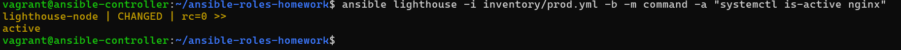

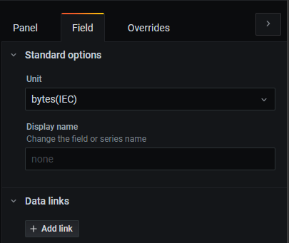

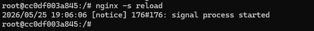


После всех произведённых настроек Dashboard будет выглядеть следующим образом:

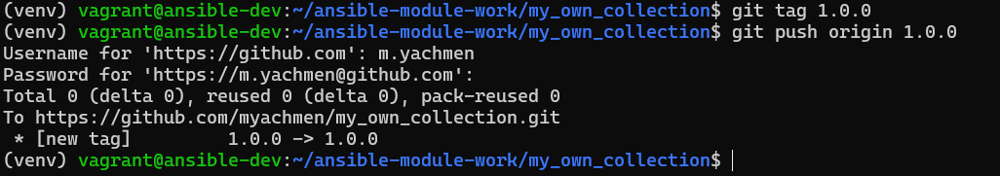


## Задание 3

1. Создайте для каждой Dashboard подходящее правило alert — можно обратиться к первой лекции в блоке «Мониторинг».
2. В качестве решения задания приведите скриншот вашей итоговой Dashboard.


## Решение 3

Для настойки ```Alert``` перейдём в режим настройки панели и переключимся на вкладку ```Alert```:

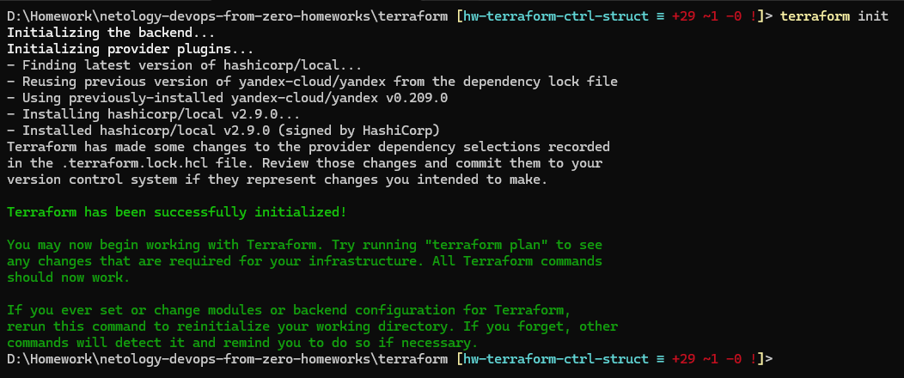

Нажмём на кнопку ```Create Alert``` и попадём в редактор:

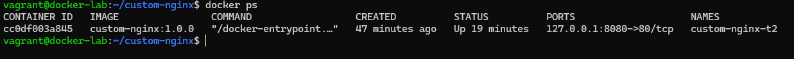

В разделе ```Conditions``` установим значение параметра ``` IS ABOVE``` равное ```80```, что будет означать срабатывание при загрузке CPU больше 80%:

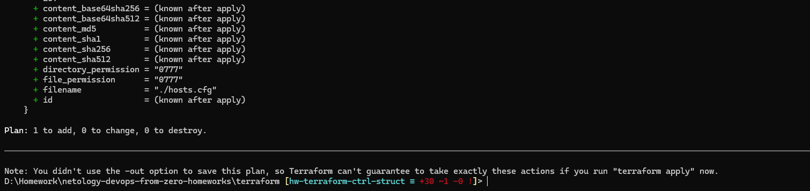

Сохраним результат нажатием кнопки ```Apply```.

Аналогичным образом настроим ```Alert``` для панели ```Load Average```.

После создания ```Alert``` установим настройки:

```
Name:           Load Average alert
Evaluate every: 1m
For:            5m
```

В разделе ```Conditions``` установим значение параметра ``` IS ABOVE``` равное ```2```:

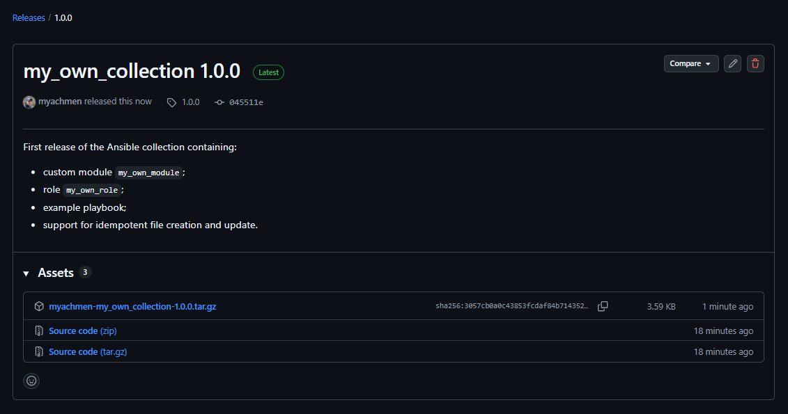

Этот ```Alert``` будет работать по логике: если средний ```Load 1m``` за последние пять минут превышает количество vCPU (2) и это состояние сохраняется 5 минут — Grafana переведёт alert в тревожное состояние.

Аналогичным образом настроим ```Alert``` для панели ```Free Memory```.

После создания ```Alert``` установим настройки:

```
Name:           Free Memory alert
Evaluate every: 1m
For:            5m
```

В разделе ```Conditions``` установим значение параметра ``` IS BELOW``` равное ```104857600```:

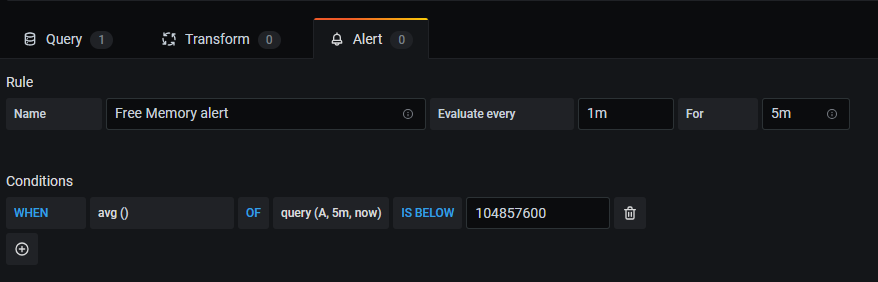

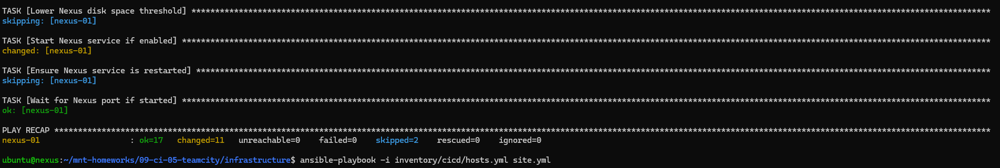

Аналогичным образом настроим ```Alert``` для панели ```Free Disk Space```.

После создания ```Alert``` установим настройки:

```
Name:           Free Disk Space alert
Evaluate every: 1m
For:            5m
```

В разделе ```Conditions``` установим значение параметра ``` IS BELOW``` равное ```32212254720```:

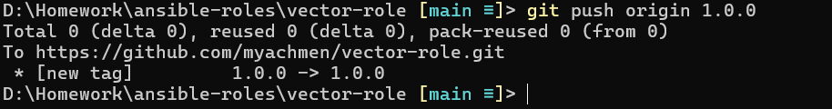

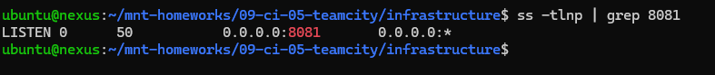

Логика работы этого ```Alert``` очень похожа на память:

```
свободный диск < 30 GiB → проблема
```

В итоге Dashboard будет иметь следующий вид:

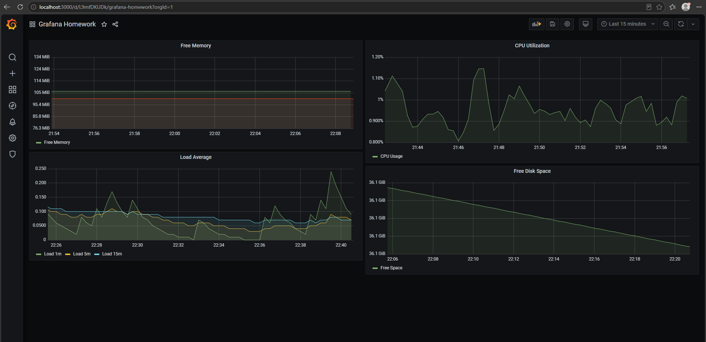


## Задание 4

1. Сохраните ваш Dashboard.Для этого перейдите в настройки Dashboard, выберите в боковом меню «JSON MODEL». Далее скопируйте отображаемое json-содержимое в отдельный файл и сохраните его.
2. В качестве решения задания приведите листинг этого файла.

## Решение 4

Для экспорта Dashboard в JSON файл воспользуемся функцией экспорта.
Для этого на странице Dashboard нажмём на значок ```Share dashboard```:

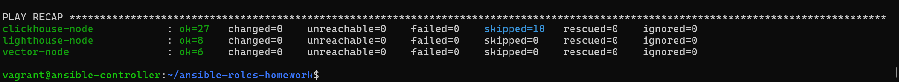

В открывшемся окне перейдём на вкладку ```Export``` и нажмём на кнопку ```Save to file```.
После этого Dasboard скачается на диск в виде JSON-файла:

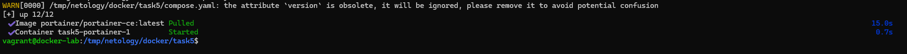

Файл доступен в [репозитории](./Grafana_Homework.json) этого домашнего задания.

Листинг содержимого JSON-файла:

```
{
  "annotations": {
    "list": [
      {
        "builtIn": 1,
        "datasource": "-- Grafana --",
        "enable": true,
        "hide": true,
        "iconColor": "rgba(0, 211, 255, 1)",
        "name": "Annotations & Alerts",
        "type": "dashboard"
      }
    ]
  },
  "editable": true,
  "gnetId": null,
  "graphTooltip": 0,
  "id": 1,
  "links": [],
  "panels": [
    {
      "alert": {
        "alertRuleTags": {},
        "conditions": [
          {
            "evaluator": {
              "params": [
                104857600
              ],
              "type": "lt"
            },
            "operator": {
              "type": "and"
            },
            "query": {
              "params": [
                "A",
                "5m",
                "now"
              ]
            },
            "reducer": {
              "params": [],
              "type": "avg"
            },
            "type": "query"
          }
        ],
        "executionErrorState": "alerting",
        "for": "5m",
        "frequency": "1m",
        "handler": 1,
        "name": "Free Memory alert",
        "noDataState": "no_data",
        "notifications": []
      },
      "aliasColors": {},
      "bars": false,
      "dashLength": 10,
      "dashes": false,
      "datasource": null,
      "fieldConfig": {
        "defaults": {
          "custom": {},
          "unit": "bytes"
        },
        "overrides": []
      },
      "fill": 1,
      "fillGradient": 0,
      "gridPos": {
        "h": 8,
        "w": 12,
        "x": 0,
        "y": 0
      },
      "hiddenSeries": false,
      "id": 6,
      "legend": {
        "avg": false,
        "current": false,
        "max": false,
        "min": false,
        "show": true,
        "total": false,
        "values": false
      },
      "lines": true,
      "linewidth": 1,
      "nullPointMode": "null",
      "options": {
        "alertThreshold": true
      },
      "percentage": false,
      "pluginVersion": "7.4.0",
      "pointradius": 2,
      "points": false,
      "renderer": "flot",
      "seriesOverrides": [],
      "spaceLength": 10,
      "stack": false,
      "steppedLine": false,
      "targets": [
        {
          "expr": "node_memory_MemFree_bytes",
          "interval": "",
          "legendFormat": "Free Memory",
          "refId": "A"
        }
      ],
      "thresholds": [
        {
          "colorMode": "critical",
          "fill": true,
          "line": true,
          "op": "lt",
          "value": 104857600,
          "visible": true
        }
      ],
      "timeFrom": null,
      "timeRegions": [],
      "timeShift": null,
      "title": "Free Memory",
      "tooltip": {
        "shared": true,
        "sort": 0,
        "value_type": "individual"
      },
      "type": "graph",
      "xaxis": {
        "buckets": null,
        "mode": "time",
        "name": null,
        "show": true,
        "values": []
      },
      "yaxes": [
        {
          "format": "bytes",
          "label": null,
          "logBase": 1,
          "max": null,
          "min": null,
          "show": true
        },
        {
          "format": "short",
          "label": null,
          "logBase": 1,
          "max": null,
          "min": null,
          "show": true
        }
      ],
      "yaxis": {
        "align": false,
        "alignLevel": null
      }
    },
    {
      "alert": {
        "alertRuleTags": {},
        "conditions": [
          {
            "evaluator": {
              "params": [
                80
              ],
              "type": "gt"
            },
            "operator": {
              "type": "and"
            },
            "query": {
              "params": [
                "A",
                "5m",
                "now"
              ]
            },
            "reducer": {
              "params": [],
              "type": "avg"
            },
            "type": "query"
          }
        ],
        "executionErrorState": "alerting",
        "for": "5m",
        "frequency": "1m",
        "handler": 1,
        "name": "CPU Utilization alert",
        "noDataState": "no_data",
        "notifications": []
      },
      "aliasColors": {},
      "bars": false,
      "dashLength": 10,
      "dashes": false,
      "datasource": null,
      "fieldConfig": {
        "defaults": {
          "custom": {},
          "unit": "percent"
        },
        "overrides": []
      },
      "fill": 1,
      "fillGradient": 0,
      "gridPos": {
        "h": 9,
        "w": 12,
        "x": 12,
        "y": 0
      },
      "hiddenSeries": false,
      "id": 2,
      "legend": {
        "avg": false,
        "current": false,
        "max": false,
        "min": false,
        "show": true,
        "total": false,
        "values": false
      },
      "lines": true,
      "linewidth": 1,
      "nullPointMode": "null",
      "options": {
        "alertThreshold": true
      },
      "percentage": false,
      "pluginVersion": "7.4.0",
      "pointradius": 2,
      "points": false,
      "renderer": "flot",
      "seriesOverrides": [],
      "spaceLength": 10,
      "stack": false,
      "steppedLine": false,
      "targets": [
        {
          "expr": "100 - (avg by(instance) (rate(node_cpu_seconds_total{mode=\"idle\"}[1m])) * 100)",
          "interval": "",
          "legendFormat": "CPU Usage",
          "refId": "A"
        }
      ],
      "thresholds": [
        {
          "colorMode": "critical",
          "fill": true,
          "line": true,
          "op": "gt",
          "value": 80,
          "visible": true
        }
      ],
      "timeFrom": null,
      "timeRegions": [],
      "timeShift": null,
      "title": "CPU Utilization",
      "tooltip": {
        "shared": true,
        "sort": 0,
        "value_type": "individual"
      },
      "type": "graph",
      "xaxis": {
        "buckets": null,
        "mode": "time",
        "name": null,
        "show": true,
        "values": []
      },
      "yaxes": [
        {
          "format": "percent",
          "label": null,
          "logBase": 1,
          "max": null,
          "min": null,
          "show": true
        },
        {
          "format": "short",
          "label": null,
          "logBase": 1,
          "max": null,
          "min": null,
          "show": true
        }
      ],
      "yaxis": {
        "align": false,
        "alignLevel": null
      }
    },
    {
      "alert": {
        "alertRuleTags": {},
        "conditions": [
          {
            "evaluator": {
              "params": [
                2
              ],
              "type": "gt"
            },
            "operator": {
              "type": "and"
            },
            "query": {
              "params": [
                "A",
                "5m",
                "now"
              ]
            },
            "reducer": {
              "params": [],
              "type": "avg"
            },
            "type": "query"
          }
        ],
        "executionErrorState": "alerting",
        "for": "5m",
        "frequency": "1m",
        "handler": 1,
        "name": "Load Average alert",
        "noDataState": "no_data",
        "notifications": []
      },
      "aliasColors": {},
      "bars": false,
      "dashLength": 10,
      "dashes": false,
      "datasource": null,
      "fieldConfig": {
        "defaults": {
          "custom": {}
        },
        "overrides": []
      },
      "fill": 1,
      "fillGradient": 0,
      "gridPos": {
        "h": 8,
        "w": 12,
        "x": 0,
        "y": 8
      },
      "hiddenSeries": false,
      "id": 4,
      "legend": {
        "avg": false,
        "current": false,
        "max": false,
        "min": false,
        "show": true,
        "total": false,
        "values": false
      },
      "lines": true,
      "linewidth": 1,
      "nullPointMode": "null",
      "options": {
        "alertThreshold": true
      },
      "percentage": false,
      "pluginVersion": "7.4.0",
      "pointradius": 2,
      "points": false,
      "renderer": "flot",
      "seriesOverrides": [],
      "spaceLength": 10,
      "stack": false,
      "steppedLine": false,
      "targets": [
        {
          "expr": "node_load1",
          "interval": "",
          "legendFormat": "Load 1m",
          "refId": "A"
        },
        {
          "expr": "node_load5",
          "hide": false,
          "interval": "",
          "legendFormat": "Load 5m",
          "refId": "B"
        },
        {
          "expr": "node_load15",
          "hide": false,
          "interval": "",
          "legendFormat": "Load 15m",
          "refId": "C"
        }
      ],
      "thresholds": [
        {
          "colorMode": "critical",
          "fill": true,
          "line": true,
          "op": "gt",
          "value": 2,
          "visible": true
        }
      ],
      "timeFrom": null,
      "timeRegions": [],
      "timeShift": null,
      "title": "Load Average",
      "tooltip": {
        "shared": true,
        "sort": 0,
        "value_type": "individual"
      },
      "type": "graph",
      "xaxis": {
        "buckets": null,
        "mode": "time",
        "name": null,
        "show": true,
        "values": []
      },
      "yaxes": [
        {
          "format": "short",
          "label": null,
          "logBase": 1,
          "max": null,
          "min": null,
          "show": true
        },
        {
          "format": "short",
          "label": null,
          "logBase": 1,
          "max": null,
          "min": null,
          "show": true
        }
      ],
      "yaxis": {
        "align": false,
        "alignLevel": null
      }
    },
    {
      "alert": {
        "alertRuleTags": {},
        "conditions": [
          {
            "evaluator": {
              "params": [
                32212254720
              ],
              "type": "lt"
            },
            "operator": {
              "type": "and"
            },
            "query": {
              "params": [
                "A",
                "5m",
                "now"
              ]
            },
            "reducer": {
              "params": [],
              "type": "avg"
            },
            "type": "query"
          }
        ],
        "executionErrorState": "alerting",
        "for": "5m",
        "frequency": "1m",
        "handler": 1,
        "name": "Free Disk Space alert",
        "noDataState": "no_data",
        "notifications": []
      },
      "aliasColors": {},
      "bars": false,
      "dashLength": 10,
      "dashes": false,
      "datasource": null,
      "fieldConfig": {
        "defaults": {
          "custom": {},
          "unit": "bytes"
        },
        "overrides": []
      },
      "fill": 1,
      "fillGradient": 0,
      "gridPos": {
        "h": 8,
        "w": 12,
        "x": 12,
        "y": 9
      },
      "hiddenSeries": false,
      "id": 8,
      "legend": {
        "avg": false,
        "current": false,
        "max": false,
        "min": false,
        "show": true,
        "total": false,
        "values": false
      },
      "lines": true,
      "linewidth": 1,
      "nullPointMode": "null",
      "options": {
        "alertThreshold": true
      },
      "percentage": false,
      "pluginVersion": "7.4.0",
      "pointradius": 2,
      "points": false,
      "renderer": "flot",
      "seriesOverrides": [],
      "spaceLength": 10,
      "stack": false,
      "steppedLine": false,
      "targets": [
        {
          "expr": "node_filesystem_free_bytes{mountpoint=\"/\"}",
          "interval": "",
          "legendFormat": "Free Space",
          "refId": "A"
        }
      ],
      "thresholds": [
        {
          "colorMode": "critical",
          "fill": true,
          "line": true,
          "op": "lt",
          "value": 32212254720,
          "visible": true
        }
      ],
      "timeFrom": null,
      "timeRegions": [],
      "timeShift": null,
      "title": "Free Disk Space",
      "tooltip": {
        "shared": true,
        "sort": 0,
        "value_type": "individual"
      },
      "type": "graph",
      "xaxis": {
        "buckets": null,
        "mode": "time",
        "name": null,
        "show": true,
        "values": []
      },
      "yaxes": [
        {
          "format": "bytes",
          "label": null,
          "logBase": 1,
          "max": null,
          "min": null,
          "show": true
        },
        {
          "format": "short",
          "label": null,
          "logBase": 1,
          "max": null,
          "min": null,
          "show": true
        }
      ],
      "yaxis": {
        "align": false,
        "alignLevel": null
      }
    }
  ],
  "schemaVersion": 27,
  "style": "dark",
  "tags": [],
  "templating": {
    "list": []
  },
  "time": {
    "from": "now-15m",
    "to": "now"
  },
  "timepicker": {},
  "timezone": "",
  "title": "Grafana Homework",
  "uid": "L9mfDKUDk",
  "version": 2
}
```


