# Домашнее задание по теме "Запуск приложений в K8S" Ячмень Марк Викторович

## Задание 1. Создать Deployment и обеспечить доступ к репликам приложения из другого Pod

1. Создать Deployment приложения, состоящего из двух контейнеров — nginx и multitool. Решить возникшую ошибку.
2. После запуска увеличить количество реплик работающего приложения до 2.
3. Продемонстрировать количество подов до и после масштабирования.
4. Создать Service, который обеспечит доступ до реплик приложений из п.1.
5. Создать отдельный Pod с приложением multitool и убедиться с помощью `curl`, что из пода есть доступ до приложений из п.1.


## Решение 1

Для выполнения задания выполним следующие действия.

Подготовим виртуальную машину с помощью Vagrant.
Для этого в папке с проектами создадим папку ```k8s-lab```.

Cоздадим пустой Vagrant файл.

Отредактируем содержимое Vagrant файла следующим образом:

```
Vagrant.configure("2") do |config|
  config.vm.box = "ubuntu/jammy64"
  config.vm.hostname = "k8s-lab"

  config.vm.network "private_network", ip: "192.168.56.10"

  config.vm.provider "virtualbox" do |vb|
    vb.name = "k8s-lab"
    vb.memory = 4096
    vb.cpus = 2
  end
end
```

Запустим создание виртуальной машины с помощью команды ```vagrant up```:

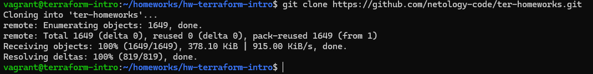

Приступим к установке ```MicroK8S```:

```
sudo snap install microk8s --classic
```

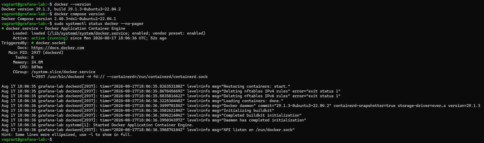

Проверим состояние ```MicroK8S```:

```
sudo microk8s status --wait-ready
```

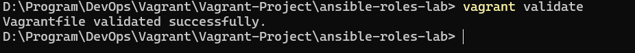

Проверим состояние узла Kubernetes:

```
sudo microk8s kubectl get nodes
```

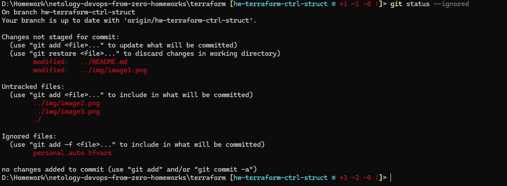

Узел находится в состоянии `Ready`, MicroK8S запущен и готов к дальнейшей работе.

Дадим пользователю ```vagrant``` доступ к ```MicroK8S```:

```
sudo usermod -a -G microk8s vagrant
sudo chown -R vagrant ~/.kube
```

Завершим текущий сеанс подключения к виртуальной машине и подключимся снова:

```
exit
vagrant ssh
```

Проверим состав групп:

```
groups
```

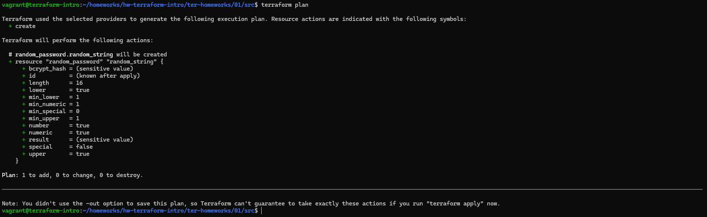

Проверим, что можно работать без ```sudo```:

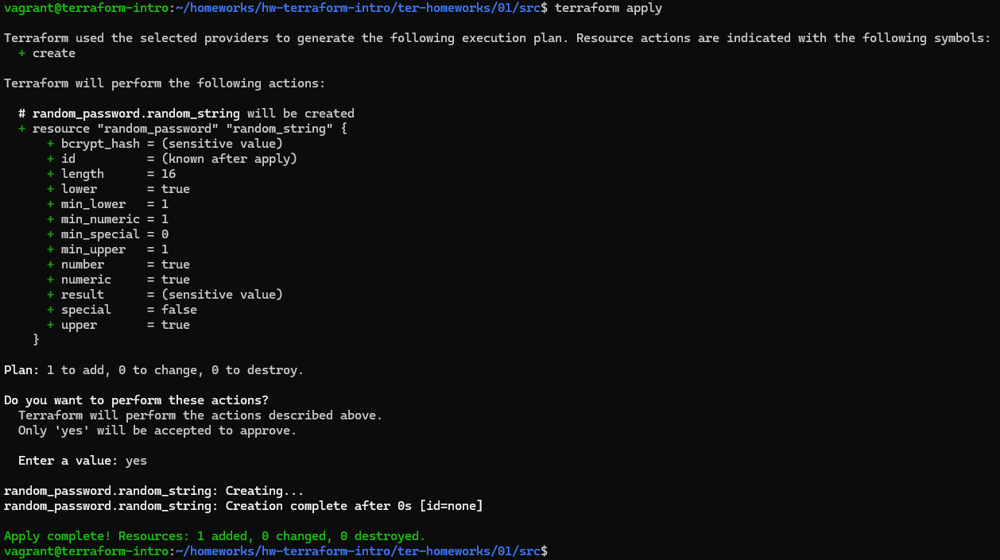

Установим локальный ```kubectl```:

```
sudo snap install kubectl --classic
```

и проверим установку:

```
kubectl version --client
```


Настроим подключение ```kubectl``` к ```MicroK8S```.

Для этого создадим каталог и выгрузим в него конфигурацию ```MicroK8S```:

```
mkdir -p ~/.kube
sudo microk8s config > ~/.kube/config
```

Настроим права и проверим работу:

```
chmod 600 ~/.kube/config
kubectl get nodes
```

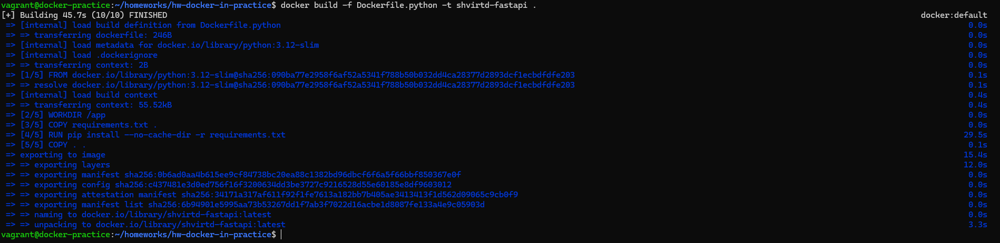

Узел `k8s-lab` находится в состоянии `Ready`, подключение к кластеру с помощью локального `kubectl` работает корректно.

Приступим к созданию  Deployment приложения, состоящего из двух контейнеров — ```nginx``` и ```multitool```.

Создадим рабочий каталог в котором создадим файл ```deployment.yaml```:

```
mkdir -p ~/k8s-homework
cd ~/k8s-homework

nano deployment.yaml
```

Содержание файла ``deployment.yaml``` будет следующим:

```
apiVersion: apps/v1
kind: Deployment
metadata:
  name: nginx-multitool
spec:
  replicas: 1
  selector:
    matchLabels:
      app: nginx-multitool
  template:
    metadata:
      labels:
        app: nginx-multitool
    spec:
      containers:
        - name: nginx
          image: nginx:1.29
          ports:
            - containerPort: 80

        - name: multitool
          image: wbitt/network-multitool
```

Применим манифест:

```
kubectl apply -f deployment.yaml
```

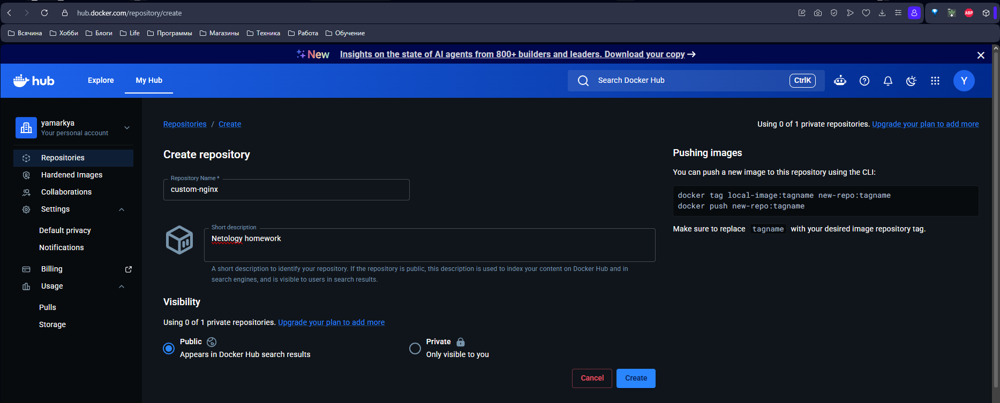

Проверим состояние созданного Deployment и запущенных Pod:

```
kubectl get deployments
kubectl get pods
```

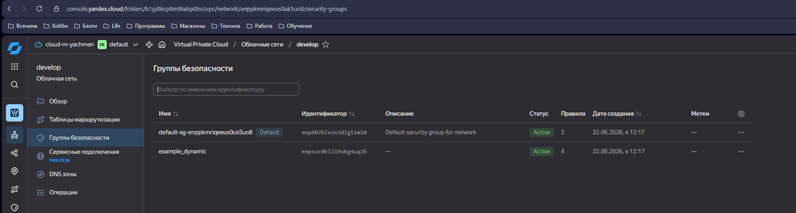

Deployment создан, однако Pod не перешёл в состояние полной готовности: из двух контейнеров готов только один (1/2), второй завершается с ошибкой и перезапускается.

Для определения причины ошибки проверим состояние Pod и логи его контейнеров.

Проверим подробное состояние Pod:

```
kubectl describe pod nginx-multitool-7b6b577496-w6jch
```

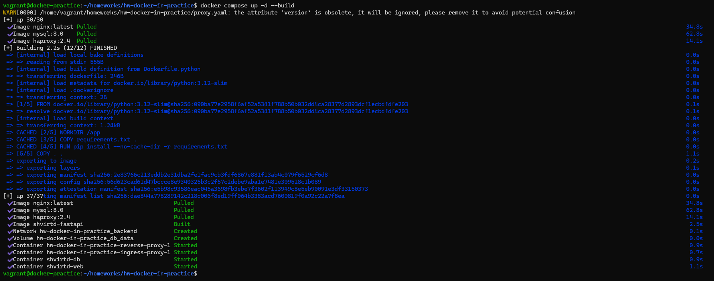

Проверим логи контейнера ```multitool```:

```
kubectl logs nginx-multitool-7b6b577496-w6jch -c multitool
```

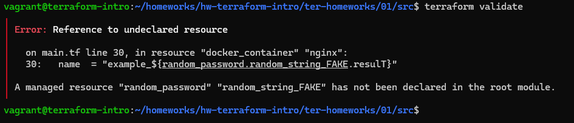

В логах видим ошибку:

```
bind() to 0.0.0.0:80 failed (98: Address in use)
```

Контейнеры одного Pod используют общий сетевой namespace. Контейнер ```nginx``` уже использует порт ```80```, а ```network-multitool``` по умолчанию также запускает встроенный nginx на порту ```80```, из-за чего возникает конфликт портов.

Для того чтобы исправить ошибку внесём изменения в файл ```deployment.yaml```:

```
apiVersion: apps/v1
kind: Deployment
metadata:
  name: nginx-multitool
spec:
  replicas: 1
  selector:
    matchLabels:
      app: nginx-multitool
  template:
    metadata:
      labels:
        app: nginx-multitool
    spec:
      containers:
        - name: nginx
          image: nginx:1.29
          ports:
            - containerPort: 80

        - name: multitool
          image: wbitt/network-multitool
          env:
            - name: HTTP_PORT
              value: "1180"
            - name: HTTPS_PORT
              value: "11443"
```

Применим сделанные изменения:

```
kubectl apply -f deployment.yaml
```

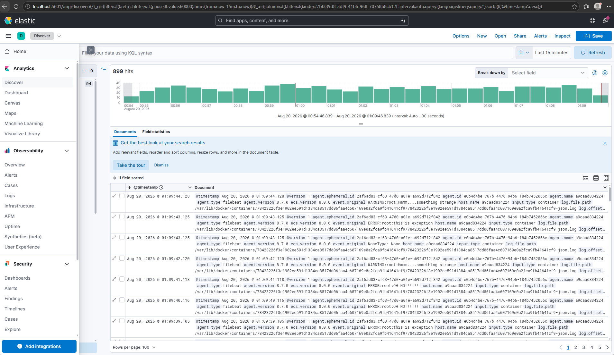

Снова проверим состояние созданного Deployment и запущенных Pod:

```
kubectl get deployments
kubectl get pods
```

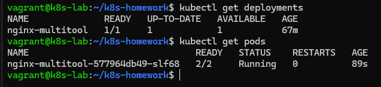

После изменения портов Deployment успешно перешёл в состояние готовности (`READY 1/1`), а Pod — в состояние `Running`. Оба контейнера внутри Pod успешно запущены (`READY 2/2`).

Таким образом, конфликт порта `80` между контейнерами `nginx` и `multitool` устранён.

Увеличим количество реплик приложения до двух.
Для этого в файле ```deployment.yaml``` изменим:

```
spec:
  replicas: 1
```

на

```
spec:
  replicas: 2
```

Применим изменения:

```
kubectl apply -f deployment.yaml
```

Проверим состояние Deployment и запущенных Pod:

```
kubectl get deployments
kubectl get pods
```

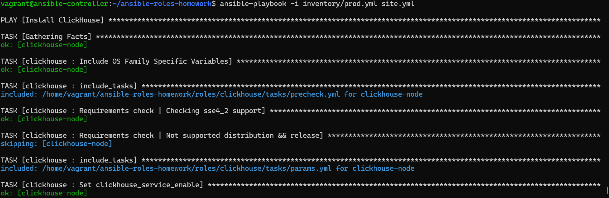

Deployment успешно масштабирован до двух реплик (`READY 2/2`). Kubernetes запустил два Pod, каждый из которых содержит по два работающих контейнера — `nginx` и `multitool`.

Создадим Service для доступа к репликам приложения.
Для этого создадим файл ```service.yaml``` следующего содержания:

```
apiVersion: v1
kind: Service
metadata:
  name: nginx-multitool-service
spec:
  selector:
    app: nginx-multitool
  ports:
    - name: nginx
      port: 80
      targetPort: 80
    - name: multitool
      port: 1180
      targetPort: 1180
```

Применим изменения:

```
kubectl apply -f service.yaml
```

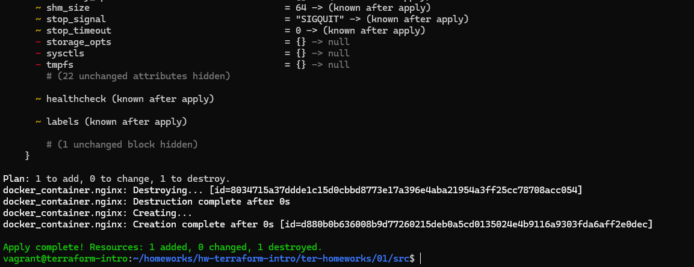

Проверим созданный Service и его endpoints:

```
kubectl get services
kubectl describe service nginx-multitool-service
kubectl get endpoints nginx-multitool-service
```

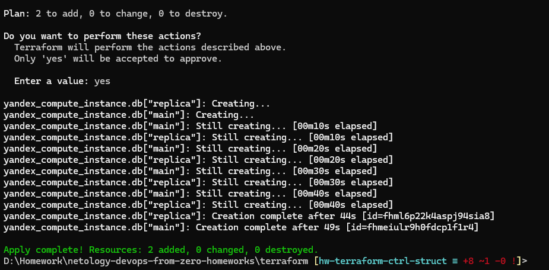

Service `nginx-multitool-service` успешно создан и получил внутренний IP-адрес `10.152.183.131`.

С помощью selector `app: nginx-multitool` Service связан с обеими репликами приложения.

Для доступа к контейнеру `nginx` Service использует порт `80`, а для доступа к контейнеру `multitool` — порт `1180`.
В списке endpoints присутствуют обе реплики приложения (`10.1.100.4` и `10.1.100.5`), следовательно Service корректно направляет трафик на созданные Pod.


Приступим к созданию отдельного Pod с приложением ```multitool```.
Создадим файл ```pod.yaml``` следующего содержания:

```
apiVersion: v1
kind: Pod
metadata:
  name: multitool-client
spec:
  containers:
    - name: multitool
      image: wbitt/network-multitool
```

Создадим отдельный Pod с приложением `multitool`:

```
kubectl apply -f pod.yaml
```

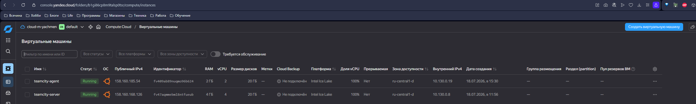

Проверим его состояние:

```
kubectl get pods
```

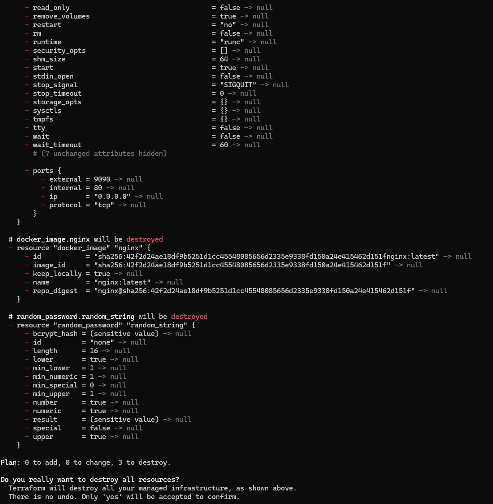

Подключимся к контейнеру:

```
kubectl exec -it multitool-client -- sh
```

Проверим доступ к контейнеру ```nginx``` через Service:

```
curl http://nginx-multitool-service
```

Проверим доступ к контейнеру ```multitool``` через Service:

```
curl http://nginx-multitool-service:1180
```

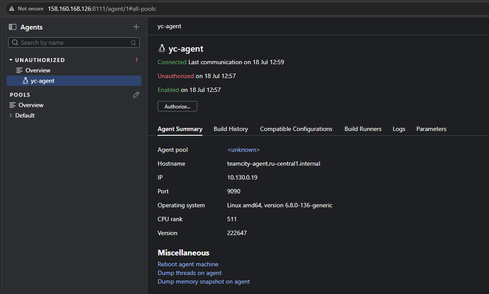

Оба запроса из отдельного Pod `multitool-client` выполнены успешно.

Запрос к Service на порт `80` вернул стандартную страницу `nginx`, а запрос на порт `1180` — ответ приложения `network-multitool`.

Таким образом, Service `nginx-multitool-service` обеспечивает доступ к репликам Deployment из другого Pod по DNS-имени сервиса.

Все пункты задания 1 выполнены: создан Deployment с двумя контейнерами, устранён конфликт портов, приложение масштабировано до двух реплик, создан Service и подтверждён доступ к приложениям из отдельного Pod.


## Задание 2. Создать Deployment и обеспечить старт основного контейнера при выполнении условий

1. Создать Deployment приложения nginx и обеспечить старт контейнера только после того, как будет запущен сервис этого приложения.
2. Убедиться, что nginx не стартует. В качестве Init-контейнера взять busybox.
3. Создать и запустить Service. Убедиться, что Init запустился.
4. Продемонстрировать состояние пода до и после запуска сервиса.


## Решение 2

Создадим Deployment приложения `nginx` с init-контейнером на базе `busybox`.

Init-контейнер будет проверять наличие DNS-имени Service `nginx-init-service` и завершится только после его появления.

Создадим файл манифеста ```deployment-init.yaml``` следующего содержания:

```
apiVersion: apps/v1
kind: Deployment
metadata:
  name: nginx-init
spec:
  replicas: 1
  selector:
    matchLabels:
      app: nginx-init
  template:
    metadata:
      labels:
        app: nginx-init
    spec:
      initContainers:
        - name: wait-for-service
          image: busybox:1.36
          command:
            - sh
            - -c
            - |
              until nslookup nginx-init-service.default.svc.cluster.local.; do
                echo "Waiting for nginx-init-service..."
                sleep 5
              done
      containers:
        - name: nginx
          image: nginx:1.29
          ports:
            - containerPort: 80
```

Применим Deployment с init-контейнером:

```
kubectl apply -f deployment-init.yaml
```

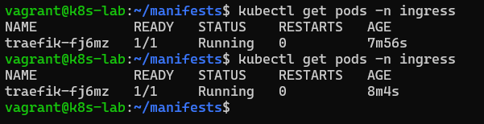

Проверим состояние Pod:

```
kubectl get pods
```

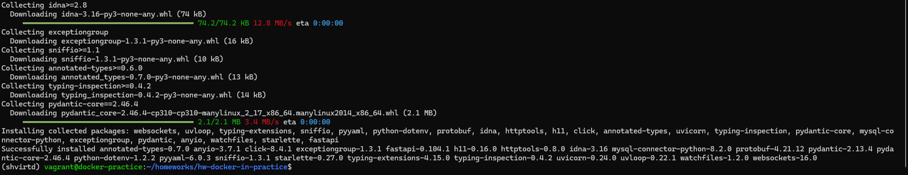

Pod nginx-init находится в состоянии Init:0/1, то есть init-контейнер ещё не завершил работу, а основной контейнер nginx пока не запущен.

Проверим логи init-контейнера:

```
kubectl logs deployment/nginx-init -c wait-for-service
```

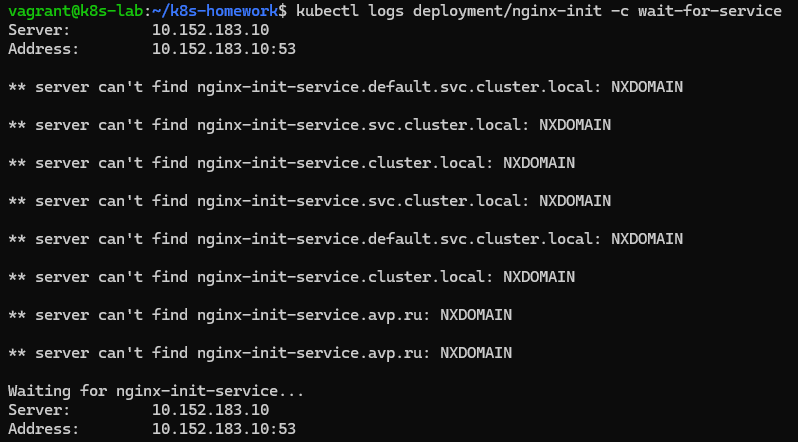

В логах видим, что DNS-имя ```nginx-init-service``` не разрешается:

```
** server can't find nginx-init-service.default.svc.cluster.local: NXDOMAIN
```

Таким образом, init-контейнер ожидает появления Service, и до его появления основной контейнер ```nginx``` не запускается.

Создадим Service `nginx-init-service`, появления которого ожидает init-контейнер:

```
apiVersion: v1
kind: Service
metadata:
  name: nginx-init-service
spec:
  selector:
    app: nginx-init
  ports:
    - port: 80
      targetPort: 80
```

Создадим Service для приложения `nginx`:

```
kubectl apply -f service-init.yaml
```

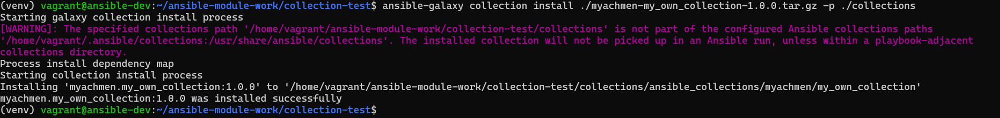

Проверим состояние Service, Pod и Deployment:

```
kubectl get services
kubectl get pods
kubectl get deployments
```

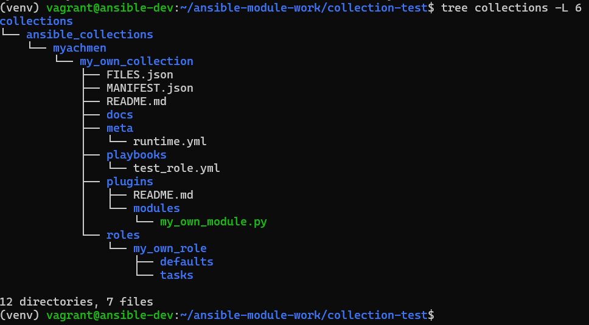

После появления Service init-контейнер успешно завершил работу, основной контейнер `nginx` был запущен, а Pod перешёл в состояние `Running`.

Проверим состояние init-контейнера:

```
kubectl get pod nginx-init-7bc67cc899-25zx8 -o jsonpath='{.status.initContainerStatuses[0].state.terminated.reason}{"\n"}'
```

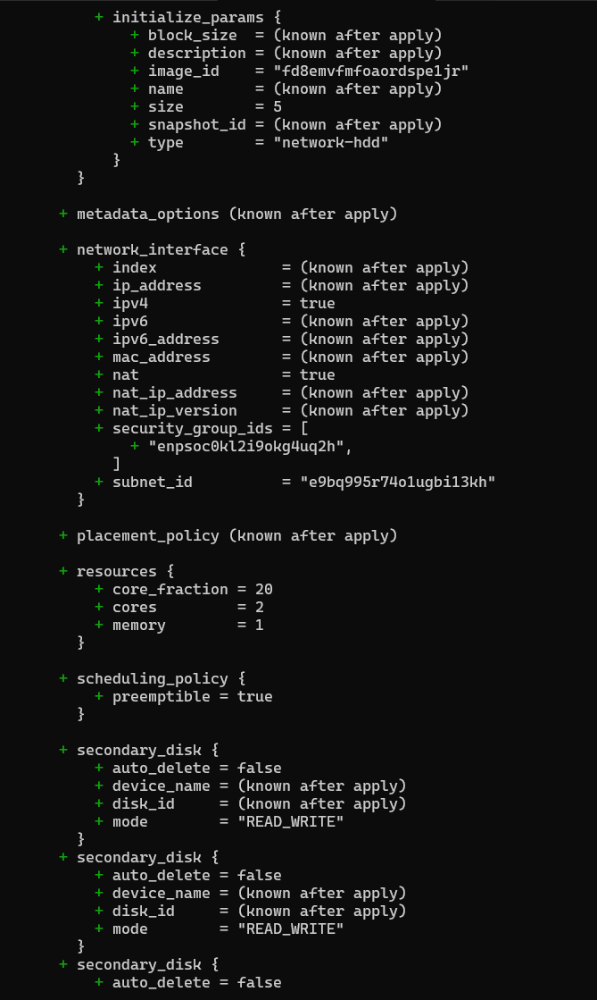

Проверим логи init-контейнера:

```
kubectl logs nginx-init-7bc67cc899-25zx8 -c wait-for-service
```

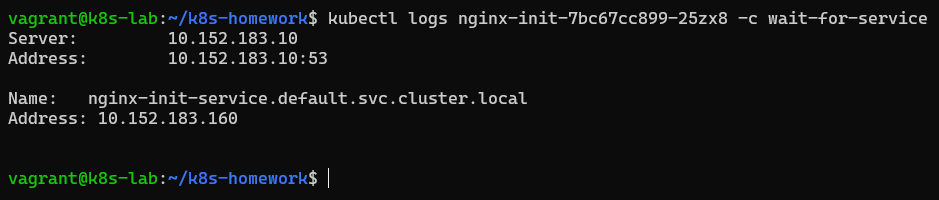

Таким образом, init-контейнер блокировал запуск основного контейнера до появления необходимого Service. После успешного разрешения DNS-имени Service init-контейнер завершился со статусом `Completed`, после чего был запущен основной контейнер `nginx`.

## Манифесты

- [deployment.yaml](manifests/deployment.yaml)
- [service.yaml](manifests/service.yaml)
- [pod.yaml](manifests/pod.yaml)
- [deployment-init.yaml](manifests/deployment-init.yaml)
- [service-init.yaml](manifests/service-init.yaml)