# Домашнее задание по теме "Teamcity" Ячмень Марк Викторович

## Подготовка к выполнению

1. В Yandex Cloud создайте новый инстанс (4CPU4RAM) на основе образа ```jetbrains/teamcity-server```.
2. Дождитесь запуска teamcity, выполните первоначальную настройку.
3. Создайте ещё один инстанс (2CPU4RAM) на основе образа ```jetbrains/teamcity-agent```. Пропишите к нему переменную окружения ```SERVER_URL: "http://<teamcity_url>:8111"```.
4. Авторизуйте агент.
5. Сделайте fork [репозитория](https://github.com/aragastmatb/example-teamcity).
6. Создайте VM (2CPU4RAM) и запустите [playbook](https://github.com/netology-code/mnt-homeworks/tree/MNT-video/09-ci-05-teamcity/infrastructure).

## Выполнение подготовки

На текущий момент в Yandex Cloud отсутствует требуемый образ, поэтому подготовим всю необходимую инфраструктуру вручную.

Создадим виртуальную машину с TeamCity Server.


После окончания процесса создания сервера подключимся к нему по shh и установим все имеющиеся обновления.

Установим Docker из официального репозитория.
Установим необходимые пакеты:

```
sudo apt install -y ca-certificates curl gnupg
```

Создадим каталог для ключей:

```
sudo install -m 0755 -d /etc/apt/keyrings
```

Добавим GPG-ключ Docker:

```
curl -fsSL https://download.docker.com/linux/ubuntu/gpg | sudo gpg --dearmor -o /etc/apt/keyrings/docker.gpg
```

Назначим необходимые права:

```
sudo chmod a+r /etc/apt/keyrings/docker.gpg
```

Добавим репозиторий Docker:

```
echo \
  "deb [arch=$(dpkg --print-architecture) signed-by=/etc/apt/keyrings/docker.gpg] \
  https://download.docker.com/linux/ubuntu \
  $(. /etc/os-release && echo "$VERSION_CODENAME") stable" | \
sudo tee /etc/apt/sources.list.d/docker.list > /dev/null
```

Обновим список пакетов и установим Docker:

```
sudo apt update

sudo apt install -y docker-ce docker-ce-cli containerd.io docker-buildx-plugin docker-compose-plugin
```

Проверим, что Docker установился корректно:

```
docker --version
docker compose version
sudo docker run hello-world
```


Добавим пользователя ```ubuntu``` в группу ```docker```, чтобы не использовать ```sudo``` для каждой команды:

```
sudo usermod -aG docker ubuntu
```

Перед установкой контейнера Teamcity Server подготовим структуру каталогов:

```
sudo mkdir -p /opt/teamcity
cd /opt/teamcity
sudo mkdir data logs
sudo chown -R ubuntu:ubuntu /opt/teamcity
ls -l /opt/teamcity
```


Подготовим файл ```compose.yaml``` следующего содержания:

```
services:
  teamcity:
    image: jetbrains/teamcity-server:latest

    container_name: teamcity-server

    restart: unless-stopped

    ports:
      - "8111:8111"

    volumes:
      - ./data:/data/teamcity_server/datadir
      - ./logs:/opt/teamcity/logs
```

Запустим контейнер Teamcity Server:

```
docker compose up -d
```


Проверим состояние контейнера:

```
docker compose ps
```


Локально проверим порт 8111:

```
curl -I http://localhost:8111
8111/tcp -> 0.0.0.0:8111
```


Откроем порт 8111 в Yandex Cloud:


Проверим, что порт доступен снаружи. Для этого в браузере откроем адрес ```http://158.160.168.126:8111``` :


Приступим к настройке TeamCity Server. Для работы приложения выберем Internal БД:


Примем лицензионное соглашение:


Создадим аккаунт администратора:


Войдем в приложение под созданным аккаунтом:


Создадим виртуальную машину с TeamCity Agent:


Подключимся ук созданной виртуальной машине ```teamcity-agent``` и выполним те же шаги, что и на первой виртуальной машине (установка обновлений и установка Docker).

Перед установкой контейнера Teamcity Agent подготовим структуру каталогов:

```
sudo mkdir -p /opt/teamcity-agent/{conf,logs,work,temp,system}
sudo chown -R ubuntu:ubuntu /opt/teamcity-agent
```

Подготовим файл ```compose.yaml``` следующего содержания:

```
services:
  teamcity-agent:
    image: jetbrains/teamcity-agent:latest
    container_name: teamcity-agent

    restart: unless-stopped

    environment:
      SERVER_URL: "http://10.130.0.8:8111"
      AGENT_NAME: "yc-agent"

    volumes:
      - /opt/teamcity-agent/conf:/data/teamcity_agent/conf
      - /opt/teamcity-agent/logs:/opt/buildagent/logs
      - /opt/teamcity-agent/work:/opt/buildagent/work
      - /opt/teamcity-agent/temp:/opt/buildagent/temp
      - /opt/teamcity-agent/system:/opt/buildagent/system

      - /var/run/docker.sock:/var/run/docker.sock

    privileged: true
```
    
Запустим контейнер Teamcity Agent:

```
docker compose up -d
```

Проверим состояние контейнера:

```
docker compose ps
```


Проверим на TeamCity Server, что агент виден:


Авторизуем агента нажав кнопку ```Authorize...```:


Проверим, что агент готов к работе, для этого перейдём на вкладку ```Parameters```:


Создадим fork учебного проекта:


Перейдём к настройке виртуальной машины, на которой будет устанолвлен Nexus.

Создадим еще одну виртуальную машину в Yandex Cloud по аналогии с предыдущими.


После установки всех текущих обновлений на виртуальную машину, установим Ansible:

```
sudo apt update
sudo apt install -y ansible git
```

Проверим, что Ansible установился:

```
ansible --version
ansible-playbook --version
```


Склонируем репозиторий:

```
git clone -b MNT-video --depth 1 https://github.com/netology-code/mnt-homeworks.git
```

Отредактируем содержимое файла ```inventory/cicd/hosts.yml```. Внесём в него данные о хосте с установленным Ansible и пропишем переменные:

```
---
all:
  hosts:
    nexus-01:
      ansible_host: 127.0.0.1

  children:
    nexus:
      hosts:
        nexus-01:

  vars:
    ansible_connection: local
    ansible_user: ubuntu
    ansible_python_interpreter: /usr/bin/python3
```

Исправим задау по установке Java в файле ```site.yml```.
Заменим блок:

```
- name: Install JDK
  become: true
  package:
    name: [java-1.8.0-openjdk, java-1.8.0-openjdk-devel]
    state: present
```

на

```
- name: Install JDK
  become: true
  ansible.builtin.apt:
    name: openjdk-8-jdk
    state: present
    update_cache: true
```

Выполним синтаксическую проверку файла:

```
ansible-playbook -i inventory/cicd/hosts.yml site.yml --syntax-check
```


Запустим playbook:

```
ansible-playbook -i inventory/cicd/hosts.yml site.yml
```


Проверим сервис ```nexus```:

```
systemctl status nexus
```


Проверим порт:

```
ss -tlnp | grep 8081
```


Проверим работу сервиса в браузере:


## Основная часть

1. Создайте новый проект в teamcity на основе fork.
2. Сделайте autodetect конфигурации.
3. Сохраните необходимые шаги, запустите первую сборку master.
4. Поменяйте условия сборки: если сборка по ветке `master`, то должен происходит `mvn clean deploy`, иначе `mvn clean test`.
5. Для deploy будет необходимо загрузить [settings.xml](./teamcity/settings.xml) в набор конфигураций maven у teamcity, предварительно записав туда креды для подключения к nexus.
6. В pom.xml необходимо поменять ссылки на репозиторий и nexus.
7. Запустите сборку по master, убедитесь, что всё прошло успешно и артефакт появился в nexus.
8. Мигрируйте `build configuration` в репозиторий.
9. Создайте отдельную ветку `feature/add_reply` в репозитории.
10. Напишите новый метод для класса Welcomer: метод должен возвращать произвольную реплику, содержащую слово `hunter`.
11. Дополните тест для нового метода на поиск слова `hunter` в новой реплике.
12. Сделайте push всех изменений в новую ветку репозитория.
13. Убедитесь, что сборка самостоятельно запустилась, тесты прошли успешно.
14. Внесите изменения из произвольной ветки `feature/add_reply` в `master` через `Merge`.
15. Убедитесь, что нет собранного артефакта в сборке по ветке `master`.
16. Настройте конфигурацию так, чтобы она собирала `.jar` в артефакты сборки.
17. Проведите повторную сборку мастера, убедитесь, что сбора прошла успешно и артефакты собраны.
18. Проверьте, что конфигурация в репозитории содержит все настройки конфигурации из teamcity.
19. В ответе пришлите ссылку на репозиторий.

## Выполнение основной части

Создадим новый проект в TeamCity:


Подключим к проекту репозиторий:


Откроем созданный проект:


Создадим Build step:


Запустим первую сборку, нажав кнопку ```Run``` в интерфейсе TeamCity Server:


Первая тестовая сборка проекта выполнена успешно. TeamCity получил исходный код из репозитория GitHub, передал задачу агенту ```yc-agent```, выполнил Maven-команду clean test и успешно завершил сборку. Все 5 автоматических тестов были пройдены без ошибок.

Отредактируем ```Maven test```.
Добавим условие:


Добавим еще один шаг сборки ```Maven deploy```:

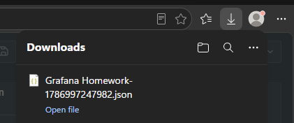

Добавим условие:

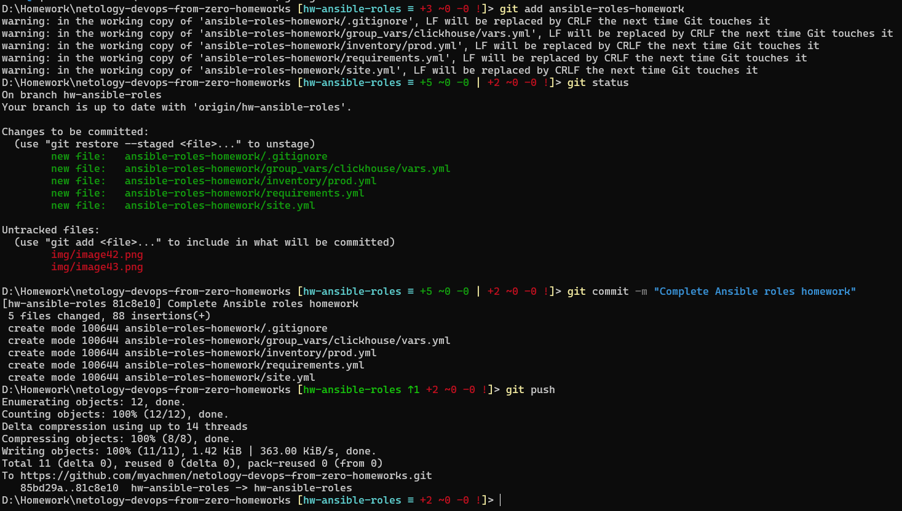

В итоге получилось два шага сборки:

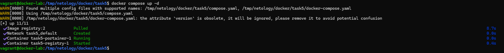

Приступим к настройке Nexus.

Проверим наличие необходимых репозиториев:

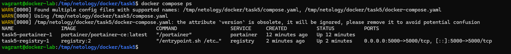

Подготовим файл ```settings.xml```. 
Проверим, что в секции:

```
<server>
      <id>nexus</id>
      <username>admin</username>
      <password>admin123</password>
    </server>

```

указаны верные учётные данные.

Загрузим файл ```settings.xml``` в TeamCity.

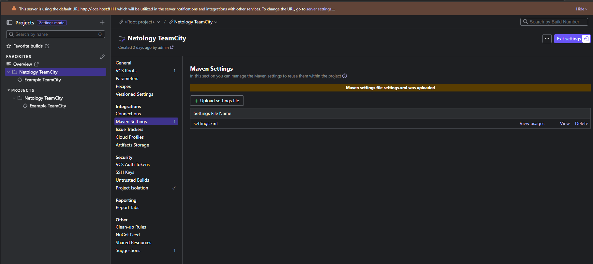


Перейдём в раздел ```Build Steps``` и в шаге ```Maven deploy``` выберем файл ```settings.xml```:

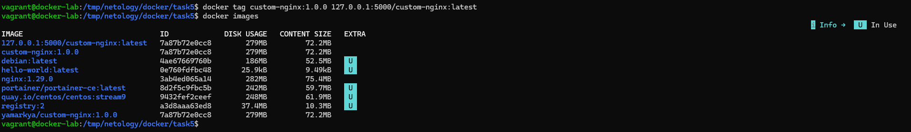

Приступим к подготовке файла ```pom.xml```.
Склонируем fork репозитория:

```
git clone https://github.com/myachmen/example-teamcity.git
```

Заменим адрес Nexus сервера, который указан в файле на адрес нашего Nexus сервера:

```
sed -i 's#http://51.250.13.64:8081/repository/maven-releases#http://10.130.0.25:8081/repository/maven-releases#' pom.xml
```

Запушим изменения в репозиторий на GitHub:

```
git status
git add pom.xml
git commit -m "Update Nexus repository URL"
git push origin master
```

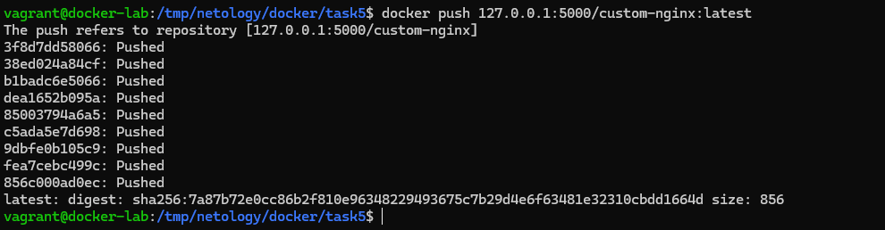

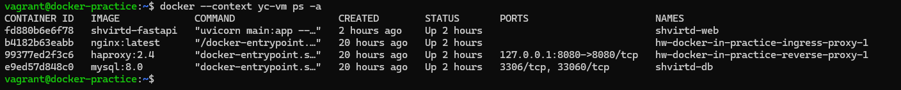

Запустим сборку ветки ```master``` и проверим публикацию артефакта в Nexus.

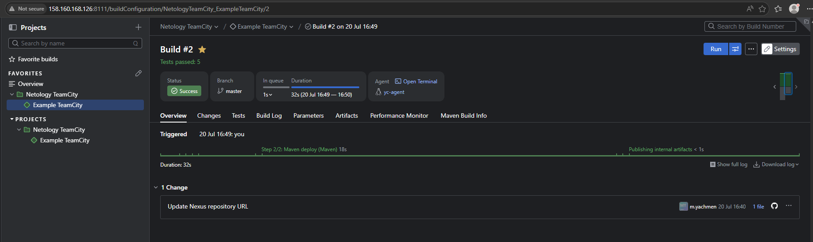

Посмотрим на лог сборки:

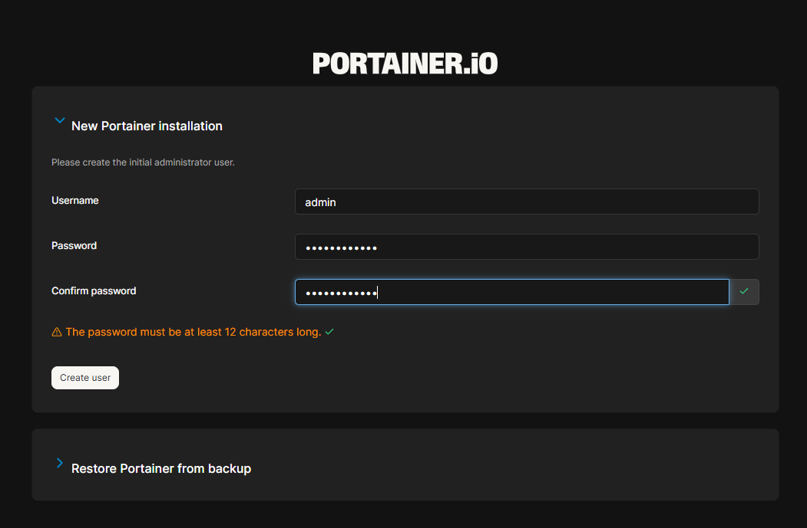

и увидим, что шаг ```Maven test``` пропущен:

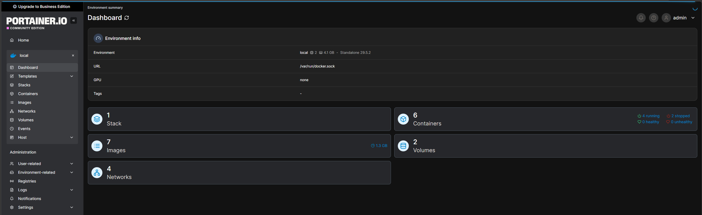

Так же мы видим, что артефакт загружен на Nexus:

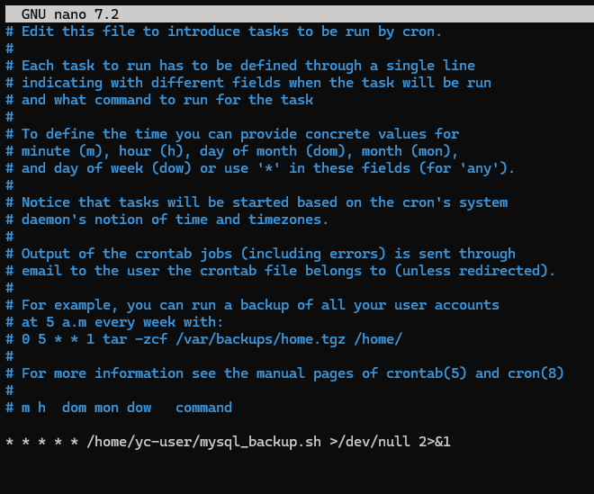

Проверим наличие артефакта в Nexus:

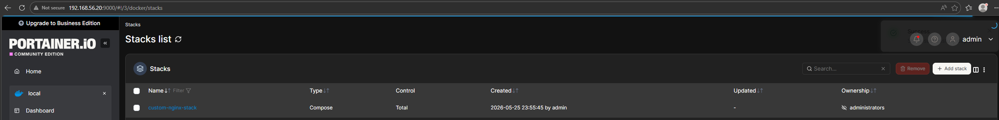

Для миграции конфигурации в репозиторий внесём изменения 
в настройки проекта.

Исправим настройки VCS Root, внесём туда данные для аутентификации на GitHub:

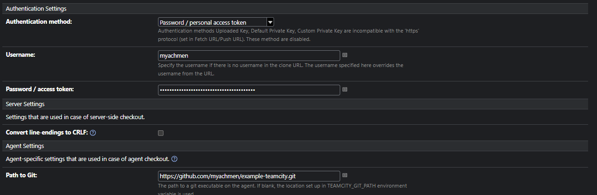


Внесём изменения в настройки проекта в разделе ```Versioned Settings```:

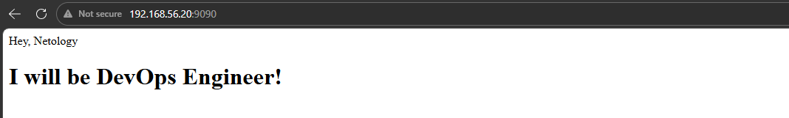

После применения настроек проверим, что конфигурация загрузилась в репозиторий на GitHub:

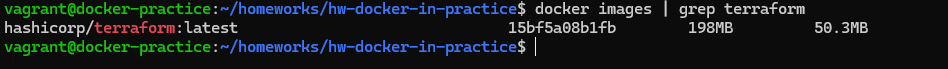

Создадим отдельную ветку ```feature/add_reply``` в репозитории:

```
git pull origin master
git switch -c feature/add_reply
git status
```

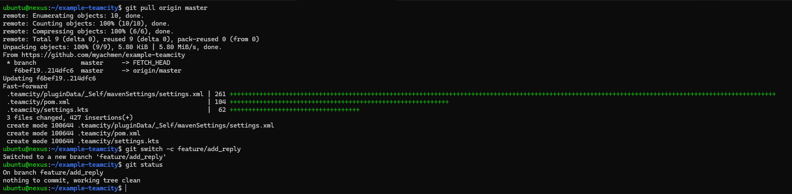

Отредактируем файл по пути ```src/main/java/plaindoll/Welcomer.java```. Добавим перед последней закрывающей скобкой секцию:

```
public String sayReply() {
    return "Keep moving forward, hunter!";
}
```

Отредактируем файл по пути ```nano src/test/java/plaindoll/WelcomerTest.java```. Добавим перед последней закрывающей скобкой секцию:

```
@Test
public void welcomerSaysReplyWithHunter() {
    assertThat(welcomer.sayReply(), containsString("hunter"));
}
```

Закоммитим изменения в новую ветку и отправим её на GitHub:

```
git add .
git commit -m "Add hunter reply"
git push -u origin feature/add_reply
```

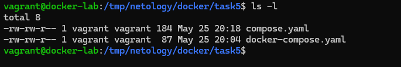

Запустим сборку из новой ветки:

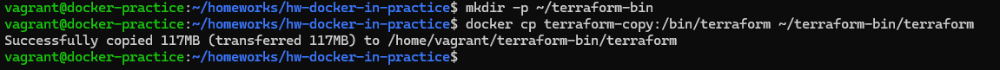

После окончания процесса мы видим, что шаг ```Maven test``` выполнился, а шаг ```Maven deploy``` нет, т.к. этот шаг выполняеттся только для ветки ```master```:

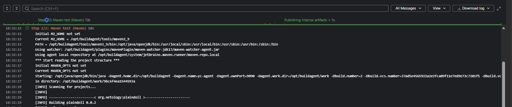

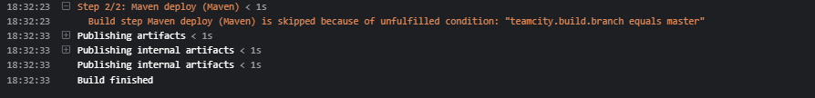


Внесём изменения из произвольной ветки ```feature/add_reply``` в ```master```. В репозитории на GitHub создадим и выполним новый ```Pull Request``` со следующими параметрами:

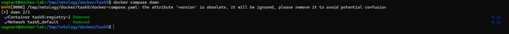

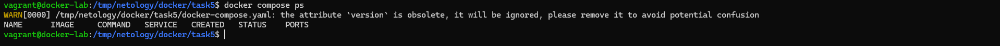

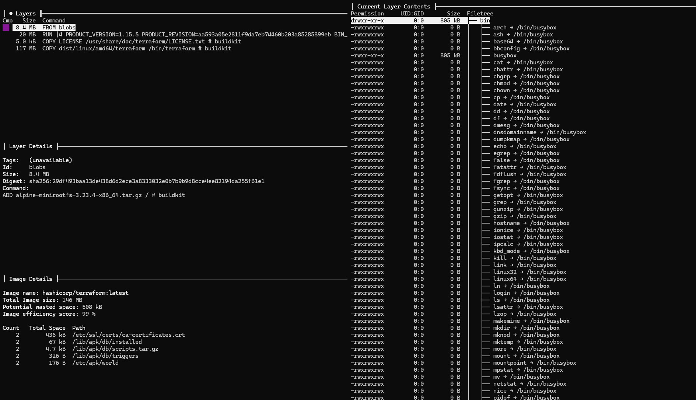

После выполнения ```Merge``` сборка в teamCity запустится снова:

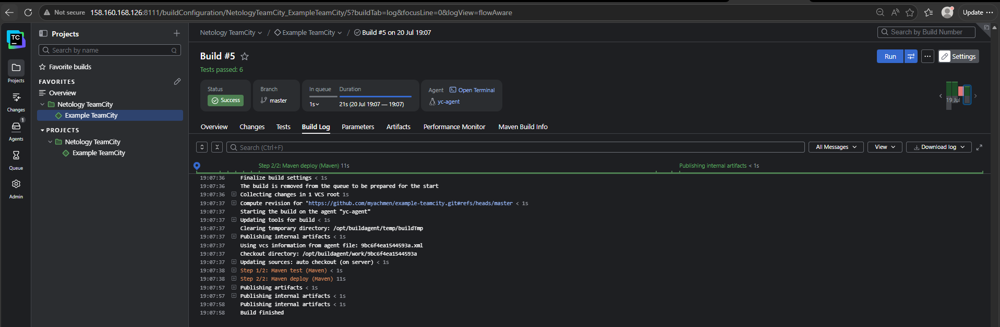

Проверим наличие артифактов в последней сборке:

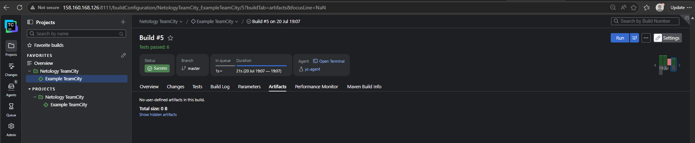

Как и положенно по заданию - артифакты отсутствуют.

Теперь приступим к настройке публикации ```.jar``` в арьефакты сборки.

Для этого в настройках сборки изменим параметр ```Artifact paths```. Добавим туда значение:

```
target/*.jar
```

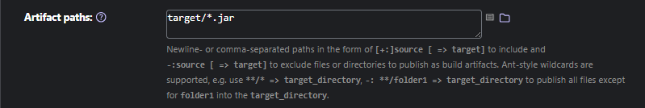

После окончания процесса сборки перейдём на вкладку ```Artifacts``` и убедимся, что требуемые артифакты появились:

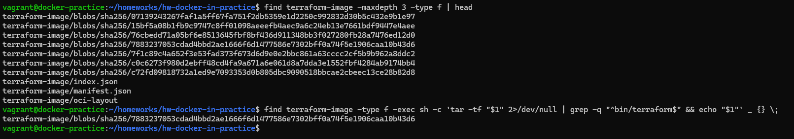

Теперь перейдём в репозиторий на GitHub и убедимся, что все настройки конфигурации из TeamCity сохрангились.
Для этого посмотрим на содержимое файла ```settings.kts```^

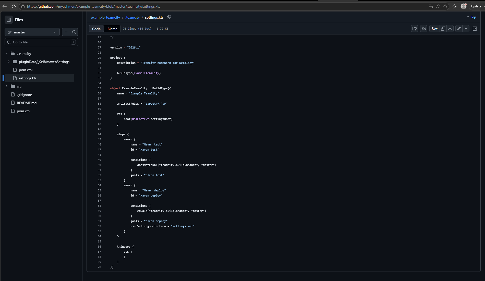