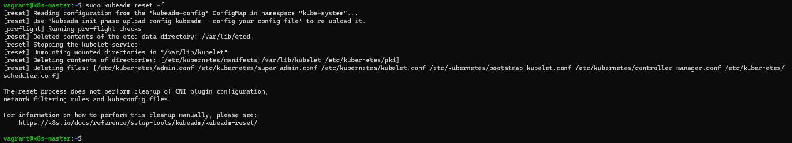
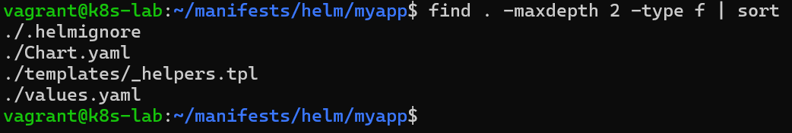
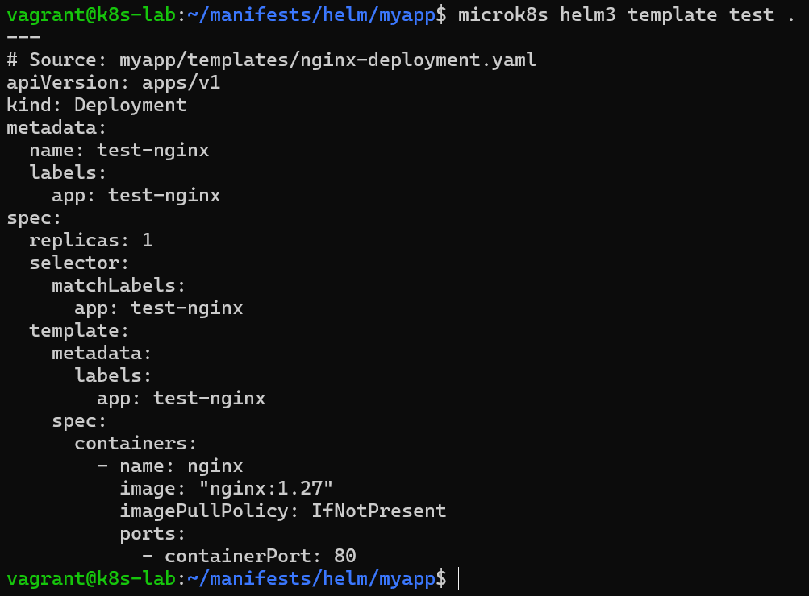
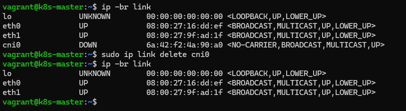
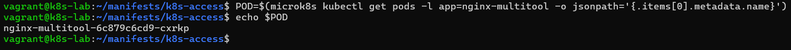
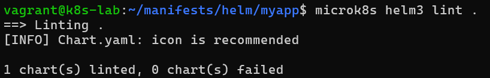
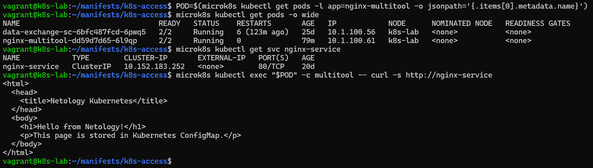
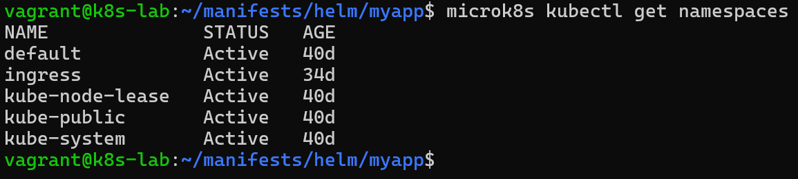
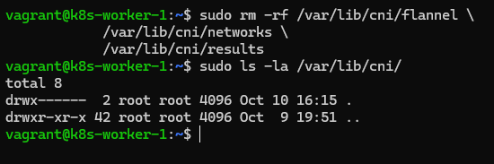

# Домашнее задание по теме "Как работает сеть в K8s" Ячмень Марк Викторович

## Задание 1. Создать сетевую политику или несколько политик для обеспечения доступа

1. Создать deployment'ы приложений frontend, backend и cache и соответсвующие сервисы.
2. В качестве образа использовать network-multitool.
3. Разместить поды в namespace App.
4. Создать политики, чтобы обеспечить доступ frontend -> backend -> cache. Другие виды подключений должны быть запрещены.
5. Продемонстрировать, что трафик разрешён и запрещён.

## Решение 1

Для выполнения домашнего задания будем использовать кластер из виртуальных машин, который мы подготовили в рамках предыдущей домашней работы.

Удалим конфигурацию текущего Kubernetes-кластера на master-ноде:

```
sudo kubeadm reset -f
```



Очистим сетевую конфигурацию:

```
sudo rm -rf /etc/cni/net.d/*
```

Эта команда удалит конфигурацию CNI, оставшуюся от Flannel.

Удалим интерфейс Flannel:

```
ip link show flannel.1
sudo ip link delete flannel.1
```



Проверим каталог с настройками CNI:

```
sudo ls -la /etc/cni/net.d/
```

Удалим содержимое этого каталога:

```
sudo rm -f /etc/cni/net.d/10-flannel.conflist
```

Проверим, что всё удалено:

```
sudo ls -la /etc/cni/net.d/
ip link show flannel.1
```



Проверим оставшиеся сетевые интерфейсы и удалим остаточный интерфейс `cni0`:

```
ip -br link
sudo ip link delete cni0
```



Подготавливим worker-ноды.
Выполним аналогичную очистку на четырёх worker-нодах.
На каждой из них (`k8s-worker-1` ... `k8s-worker-4`) последовательно выполним:

```
sudo kubeadm reset -f

sudo rm -f /etc/cni/net.d/10-flannel.conflist
sudo ip link delete flannel.1 2>/dev/null || true
sudo ip link delete cni0 2>/dev/null || true
```



Проверим состояние:

```
hostname
sudo ls -la /etc/cni/net.d/
ip -br link
```



Проверим остаточную конфигурацию сети.
На ноде `k8s-master` выполним:

```
sudo ls -la /var/lib/cni/
sudo iptables-save | grep -E 'FLANNEL|CNI-|KUBE-' | head -30
```

На ней же проверим состояние containerd:

```
sudo systemctl is-active containerd
```



В выводе команд присутствуют остатки Flannel и старых сетевых правил Kubernetes.

Выполним очистку состояния CNI:

```
sudo rm -rf /var/lib/cni/flannel \
            /var/lib/cni/networks \
            /var/lib/cni/results
```

Проверим результат:

```
sudo ls -la /var/lib/cni/
```



Выполним очистку CNI на worker-нодах.
На каждой из них (`k8s-worker-1` ... `k8s-worker-4`) последовательно выполним те же команды.



Для очистки правил iptables выполним перезагрузку виртуальных машин со следующей проверкой:

```
vagrant reload --no-provision
```

После перезагрузки выполним проверку:

```
ip -br link
sudo iptables-save | grep -E 'FLANNEL|CNI-|KUBE-' | head -30
sudo systemctl is-active containerd
```