# Домашнее задание к занятию «Установка Kubernetes»

## Задание 1. Установить кластер k8s с 1 master node

### Решение 1

Создадим отдельный Host-Only адаптер для Kubernetes-кластера с адресом `192.168.57.1/24`:

```
VBoxManage hostonlyif create
```


Проверим, что в конфигурации появился второй адаптер:

```
VBoxManage list hostonlyifs
```


Настроим IP адрес для нового адаптера:

```
VBoxManage hostonlyif ipconfig "VirtualBox Host-Only Ethernet Adapter #2" --ip 192.168.57.1 --netmask 255.255.255.0
```

Проверим результат:

```
VBoxManage list hostonlyifs
```


Создадим каталог проекта:

```
New-Item -ItemType Directory -Path "k8s-install" -Force
```


В каталоге создадим `Vagrantfile` со следующим содержимым:

```

Vagrant.configure("2") do |config|
  config.vm.box = "bento/ubuntu-22.04"
  config.vm.box_version = "202510.26.0"

  config.vm.synced_folder ".", "/vagrant", disabled: true

  nodes = [
    { name: "k8s-master",   ip: "192.168.57.10", memory: 4096 },
    { name: "k8s-worker-1", ip: "192.168.57.11", memory: 2048 },
    { name: "k8s-worker-2", ip: "192.168.57.12", memory: 2048 },
    { name: "k8s-worker-3", ip: "192.168.57.13", memory: 2048 },
    { name: "k8s-worker-4", ip: "192.168.57.14", memory: 2048 }
  ]

  nodes.each do |node|
    config.vm.define node[:name] do |machine|
      machine.vm.hostname = node[:name]

      machine.vm.network "private_network",
        ip: node[:ip],
        virtualbox__intnet: false,
        name: "VirtualBox Host-Only Ethernet Adapter #2"

      machine.vm.provider "virtualbox" do |vb|
        vb.name = node[:name]
        vb.memory = node[:memory]
        vb.cpus = 2
        vb.customize [
          "modifyvm", :id,
          "--audio-enabled", "off"
        ]
      end
    end
  end
end
```

Проверим Vagrantfile и запустим создание одной виртуальной машины, для того чтобы проверить параметры:

```
vagrant validate
vagrant up k8s-master --provider=virtualbox
```


Проверим IP адрес внутри созданной виртуальной машины:

```
vagrant ssh k8s-master -c "hostname; ip -4 -br addr"
```


Все настройки соответствуют запланированным.
Теперь развернём четыре worker-ноды:

```
vagrant up k8s-worker-1 k8s-worker-2 k8s-worker-3 k8s-worker-4 --provider=virtualbox
```

Проверим hostname и IP-адреса всех узлов:

```
$nodes = @(
    "k8s-master",
    "k8s-worker-1",
    "k8s-worker-2",
    "k8s-worker-3",
    "k8s-worker-4"
)

foreach ($node in $nodes) {
    Write-Host "`n===== $node =====" -ForegroundColor Cyan
    vagrant ssh $node -c "hostname; ip -4 -br addr"
}
```


Проверим связь между узлами:

```
vagrant ssh k8s-master -c "ping -c 3 192.168.57.11"
```


Проверим связь со всеми worker-нодами.
Подключимся по ssh к ноде `k8s-master`:

```
vagrant ssh k8s-master
```

и выполним команду:

```
for ip in 192.168.57.11 192.168.57.12 192.168.57.13 192.168.57.14; do
    echo "=== $ip ==="
    ping -c 2 "$ip"
done
```


Отключим swap на ноде `k8s-master` и отключим автоматическое подключение swap при загрузке Ubuntu:

```
sudo swapoff -a
sudo sed -i.bak '/^[^#].*[[:space:]]swap[[:space:]]/s/^/#/' /etc/fstab
```

Проверим результат:

```
swapon --show
free -h
grep -n swap /etc/fstab
```

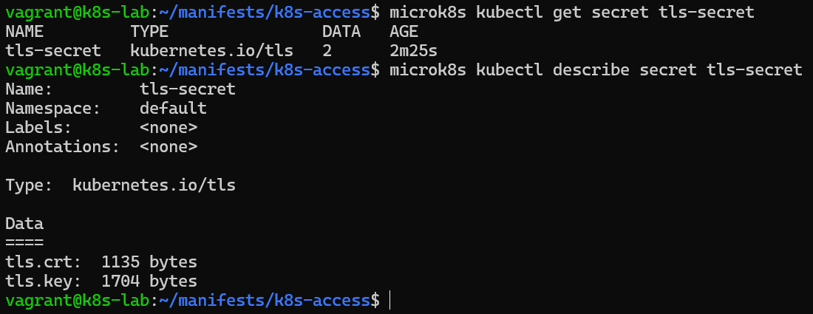

По умолчанию kubelet при стандартной конфигурации ожидает отключённый swap. Если оставить его включённым, на этапе запуска Kubernetes могут возникнуть проблемы.

Приступим к настройке модулей ядра:

```
sudo tee /etc/modules-load.d/k8s.conf > /dev/null <<'EOF'
overlay
br_netfilter
EOF
```

Загрузим модули:

```
sudo modprobe overlay
sudo modprobe br_netfilter
```

Создадим файл параметров ядра:

```
sudo tee /etc/sysctl.d/99-kubernetes.conf > /dev/null <<'EOF'
net.bridge.bridge-nf-call-iptables = 1
net.bridge.bridge-nf-call-ip6tables = 1
net.ipv4.ip_forward = 1
EOF
```

Применим настройки:

```
sudo sysctl --system
```

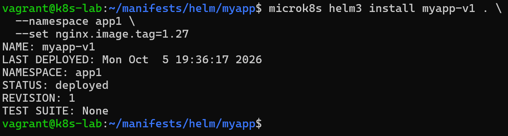

Проверим результат:

```
lsmod | grep -E 'overlay|br_netfilter'
```

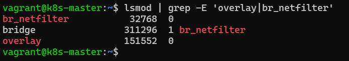

Ошибки в выводе означают, что некоторые системные параметры Ubuntu не удалось установить. Причиной могут быть особенности текущего ядра или сетевого окружения.

Проверим `sysctl`:

```
sysctl net.bridge.bridge-nf-call-iptables
sysctl net.bridge.bridge-nf-call-ip6tables
sysctl net.ipv4.ip_forward

sysctl net.ipv4.conf.all.accept_source_route
sysctl net.ipv4.conf.all.promote_secondaries
```

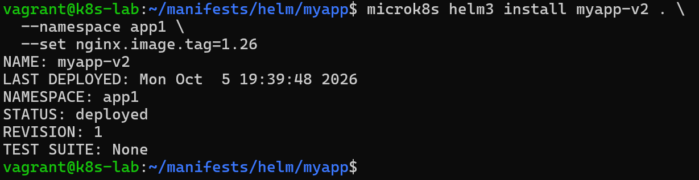

Проверка подтвердила, что все необходимые параметры ядра для Kubernetes настроены правильно.

Создадим каталог для скриптов:

```
New-Item -ItemType Directory -Path ".\scripts" -Force
```

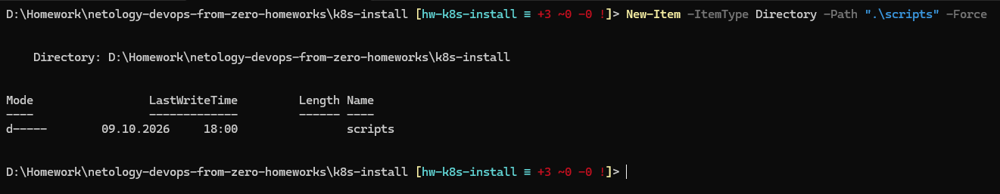

Создадим файл `prepare-nodes.sh` следующего содержания:

```

#!/usr/bin/env bash
set -euo pipefail

echo "=== Preparing Kubernetes node: $(hostname) ==="

# 1. Disable swap
echo "[1/4] Disabling swap..."
swapoff -a

if grep -Eq '^[^#].*[[:space:]]swap[[:space:]]' /etc/fstab; then
    sed -i.bak '/^[^#].*[[:space:]]swap[[:space:]]/s/^/#/' /etc/fstab
fi

# 2. Load required kernel modules
echo "[2/4] Configuring kernel modules..."

cat > /etc/modules-load.d/k8s.conf <<'EOF'
overlay
br_netfilter
EOF

modprobe overlay
modprobe br_netfilter

# 3. Configure networking
echo "[3/4] Configuring sysctl..."

cat > /etc/sysctl.d/99-kubernetes.conf <<'EOF'
net.bridge.bridge-nf-call-iptables = 1
net.bridge.bridge-nf-call-ip6tables = 1
net.ipv4.ip_forward = 1
EOF

sysctl -p /etc/sysctl.d/99-kubernetes.conf

# 4. Verify configuration
echo "[4/4] Verifying configuration..."

if [ -n "$(swapon --noheadings --show)" ]; then
    echo "ERROR: Swap is still enabled"
    exit 1
fi

for module in overlay br_netfilter; do
    if ! lsmod | grep -q "^${module} "; then
        echo "ERROR: Kernel module ${module} is not loaded"
        exit 1
    fi
done

for parameter in \
    net.bridge.bridge-nf-call-iptables \
    net.bridge.bridge-nf-call-ip6tables \
    net.ipv4.ip_forward
do
    value=$(sysctl -n "$parameter")
    if [ "$value" != "1" ]; then
        echo "ERROR: ${parameter}=${value}, expected 1"
        exit 1
    fi
done

echo "=== Kubernetes node preparation completed successfully ==="
```

Скрипт выполняет те же настройки, которые мы уже проверили вручную на ноде `k8s-master`.

Подключим скрипт к Vagrant.
Для этого в `Vagrantfile` внутри блока `config.vm.define` добавим строки:

```
machine.vm.provision "shell",
  path: "scripts/prepare-nodes.sh",
  privileged: true
```

Проверим конфигурацию:

```
vagrant validate
```

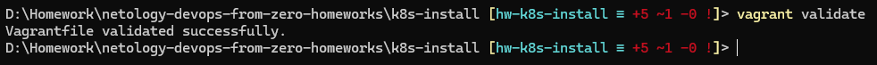

Выполним проверку `provisioning` на `k8s-master`:

```
vagrant provision k8s-master
```

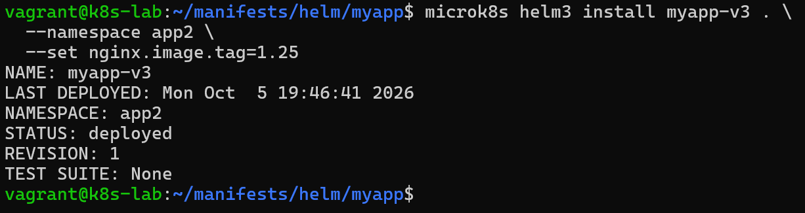

Запустим скрипт на остальных четырёх машинах:

```
vagrant provision k8s-worker-1 k8s-worker-2 k8s-worker-3 k8s-worker-4
```

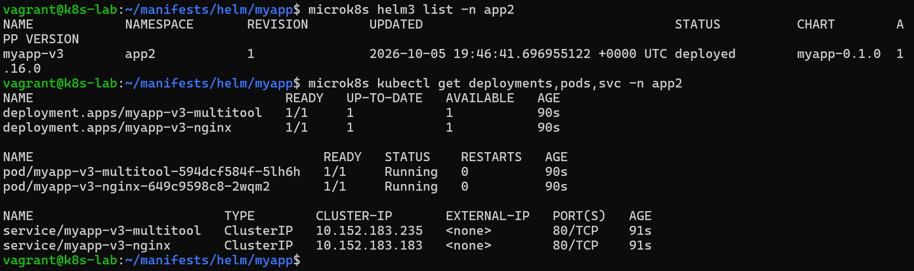

Проверим состояние всех пяти узлов:

```
vagrant status
```

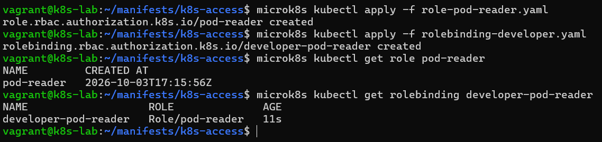

Проверим доступность `containerd`:

```
apt-cache policy containerd
```

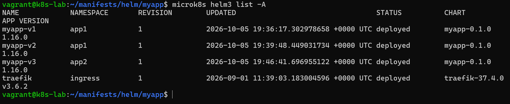

Проверим наличие уже установленной контейнерной среды:

```
command -v containerd || true
dpkg -l | grep -E '^ii[[:space:]]+(containerd|containerd.io)' || true
```

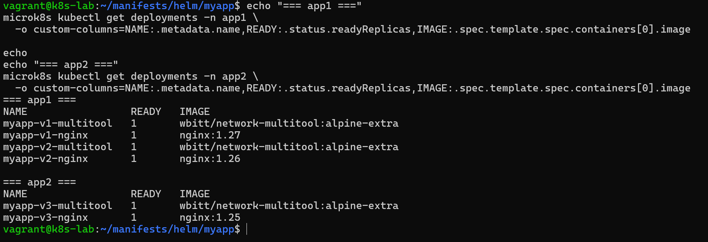

Подготовим скрипт установки `containerd`.
Создадим файл `install-containerd.sh` следующего содержания:

```

#!/usr/bin/env bash
set -euo pipefail

echo "=== Installing containerd on $(hostname) ==="

export DEBIAN_FRONTEND=noninteractive

# Install containerd from Ubuntu repositories
apt-get update
apt-get install -y containerd

# Generate configuration for the installed version
mkdir -p /etc/containerd

if [ ! -f /etc/containerd/config.toml ]; then
    containerd config default > /etc/containerd/config.toml
fi

# Detect containerd configuration version
CONFIG_VERSION=$(containerd config dump | grep -m1 '^version = ' || true)

echo "Containerd configuration: ${CONFIG_VERSION}"

# Configure systemd cgroups for containerd 1.x or 2.x
if grep -q 'SystemdCgroup = false' /etc/containerd/config.toml; then
    sed -i 's/SystemdCgroup = false/SystemdCgroup = true/g' \
        /etc/containerd/config.toml
fi

# Ensure CRI is not disabled
if grep -Eq '^disabled_plugins[[:space:]]*=' /etc/containerd/config.toml; then
    sed -i '/^disabled_plugins[[:space:]]*=/s/"cri"//g' \
        /etc/containerd/config.toml
fi

systemctl enable --now containerd
systemctl restart containerd

echo "=== Verifying containerd ==="

containerd --version
systemctl is-active --quiet containerd

if ! grep -q 'SystemdCgroup = true' /etc/containerd/config.toml; then
    echo "ERROR: SystemdCgroup is not enabled"
    exit 1
fi

echo "=== Containerd installation completed successfully ==="
```

Подключим скрипт к Vagrant.
Для этого в `Vagrantfile` внутри блока `config.vm.define` добавим строки:

```
machine.vm.provision "shell",
  path: "scripts/install-containerd.sh",
  privileged: true
```

Проверим конфигурацию:

```
vagrant validate
```

Установим `containerd` на ноду `k8s-master`:

```
vagrant provision k8s-master
```

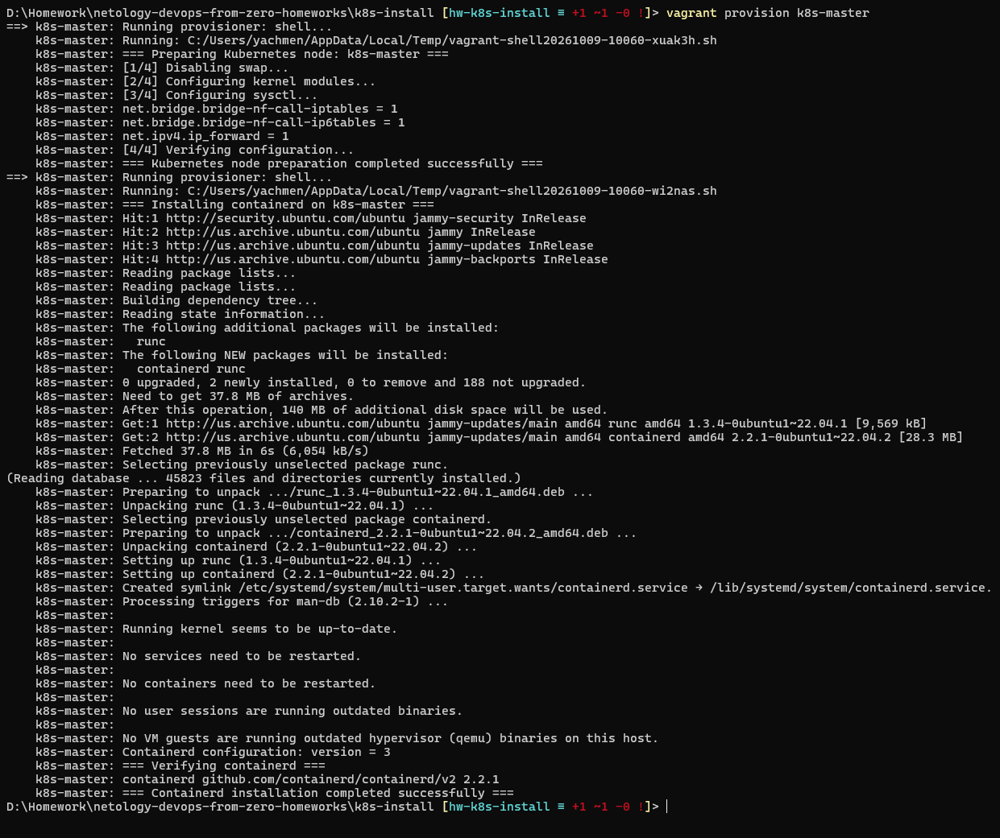

Проверим установленный `containerd`.
Внутри виртуальной машины `k8s-master` выполним:

```
containerd --version
systemctl is-active containerd
sudo containerd config dump | grep -E 'version =|SystemdCgroup|disabled_plugins'
```

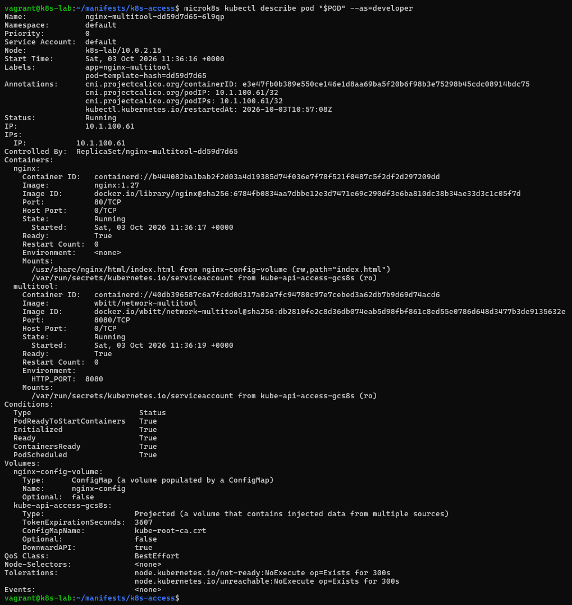

Проверим, что `containerd` действительно создал сокет для взаимодействия с Kubernetes:

```
ls -l /run/containerd/containerd.sock
```

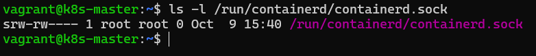

Проверим CRI (Container Runtime Interface) перед установкой на остальные узлы.
Именно через CRI компонент `kubelet` будет взаимодействовать с `containerd`.

Внутри виртуальной машины `k8s-master` выполним:

```
command -v crictl || true
sudo ctr plugins ls | grep -E 'cri|runtime'
sudo journalctl -u containerd -b --no-pager -n 30
```

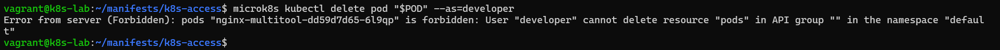

В выводе присутствует сообщение:

```
failed to load cni during init
cni config load failed: no network config found in /etc/cni/net.d
```

CNI (Container Network Interface) — механизм, с помощью которого Kubernetes организует сетевое взаимодействие контейнеров и Pod.
Мы пока установили только containerd. Сам Kubernetes и сетевой плагин ещё не установлены, поэтому каталог /etc/cni/net.d не содержит необходимой конфигурации.
После инициализации кластера и установки выбранного CNI-плагина эта проблема должна исчезнуть.

Установим `containerd` на остальные четыре узла:

```
vagrant provision k8s-worker-1 k8s-worker-2 k8s-worker-3 k8s-worker-4
```

Проверим все пять узлов:

```
$nodes = @(
    "k8s-master",
    "k8s-worker-1",
    "k8s-worker-2",
    "k8s-worker-3",
    "k8s-worker-4"
)

foreach ($node in $nodes) {
    Write-Host "`n===== $node =====" -ForegroundColor Cyan

    vagrant ssh $node -c 'sudo ctr plugins ls'
}
```

Для автоматизации установки создадим файл `install-kubernetes.sh` следующего содержания:

```
#!/usr/bin/env bash
set -euo pipefail

K8S_MINOR="v1.36"
K8S_PACKAGE_VERSION="1.36.5-1.1"

echo "=== Installing Kubernetes components on $(hostname) ==="

export DEBIAN_FRONTEND=noninteractive

# 1. Install prerequisites
apt-get update
apt-get install -y apt-transport-https ca-certificates curl gpg

# 2. Configure Kubernetes APT repository
install -d -m 0755 /etc/apt/keyrings

curl -fsSL \
  "https://pkgs.k8s.io/core:/stable:/${K8S_MINOR}/deb/Release.key" \
  | gpg --dearmor --yes \
      -o /etc/apt/keyrings/kubernetes-apt-keyring.gpg

chmod 0644 /etc/apt/keyrings/kubernetes-apt-keyring.gpg

echo "deb [signed-by=/etc/apt/keyrings/kubernetes-apt-keyring.gpg] https://pkgs.k8s.io/core:/stable:/${K8S_MINOR}/deb/ /" \
  > /etc/apt/sources.list.d/kubernetes.list

# 3. Install pinned Kubernetes version
apt-get update

apt-mark unhold kubelet kubeadm kubectl 2>/dev/null || true

apt-get install -y \
  "kubelet=${K8S_PACKAGE_VERSION}" \
  "kubeadm=${K8S_PACKAGE_VERSION}" \
  "kubectl=${K8S_PACKAGE_VERSION}"

# 4. Prevent unintended upgrades
apt-mark hold kubelet kubeadm kubectl

# 5. Enable kubelet
systemctl enable kubelet

# 6. Verify installation
echo "=== Installed Kubernetes versions ==="
kubeadm version -o short
kubectl version --client
kubelet --version

echo "=== Kubernetes components installation completed successfully ==="
```

Подключим скрипт к Vagrant.
Для этого в `Vagrantfile` внутри блока `config.vm.define` добавим строки:

```
machine.vm.provision "shell",
  name: "install-kubernetes",
  path: "scripts/install-kubernetes.sh",
  privileged: true
```

Проверим конфигурацию:

```
vagrant validate
```

Установим Kubernetes на ноду `k8s-master`:

```
vagrant provision k8s-master --provision-with install-kubernetes
```

Проверим установленные версии.
Внутри виртуальной машины `k8s-master` выполним:

```
kubeadm version -o short
kubelet --version
kubectl version --client
```

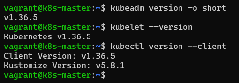

Установим Kubernetes на четыре worker-узла:

```
vagrant provision k8s-worker-1 k8s-worker-2 k8s-worker-3 k8s-worker-4 --provision-with install-kubernetes
```

Проверим версии и фиксацию пакетов сразу на всех пяти узлах:

```
$nodes = @(
    "k8s-master",
    "k8s-worker-1",
    "k8s-worker-2",
    "k8s-worker-3",
    "k8s-worker-4"
)

foreach ($node in $nodes) {
    Write-Host "`n===== $node =====" -ForegroundColor Cyan

    vagrant ssh $node -c 'kubeadm version -o short; kubelet --version; kubectl version --client; apt-mark showhold'
}
```

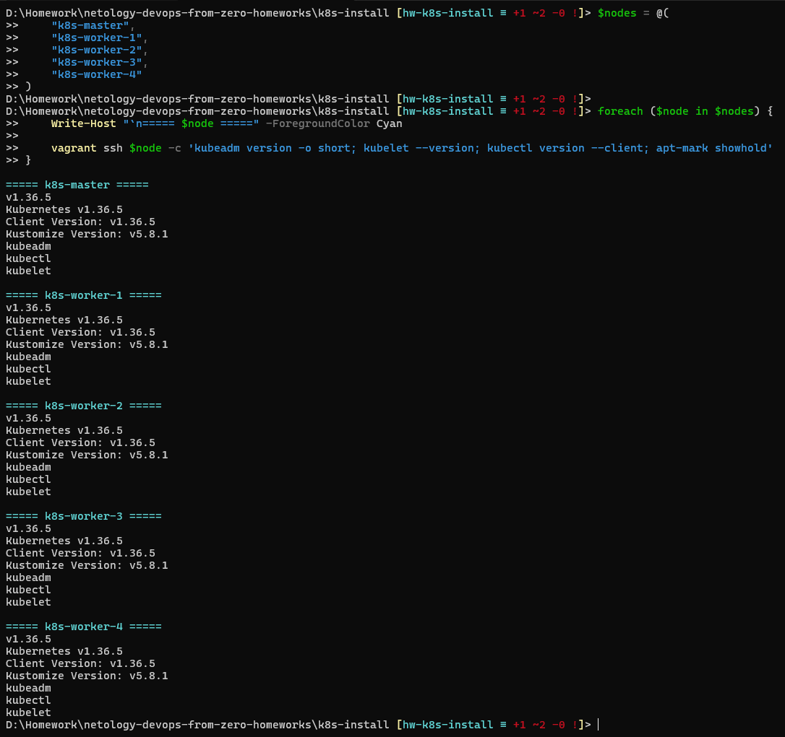

Инициализируем Kubernetes:

```
sudo kubeadm init \
  --apiserver-advertise-address=192.168.57.10 \
  --control-plane-endpoint=192.168.57.10 \
  --pod-network-cidr=10.244.0.0/16 \
  --cri-socket=unix:///run/containerd/containerd.sock \
  --kubernetes-version=v1.36.5
```

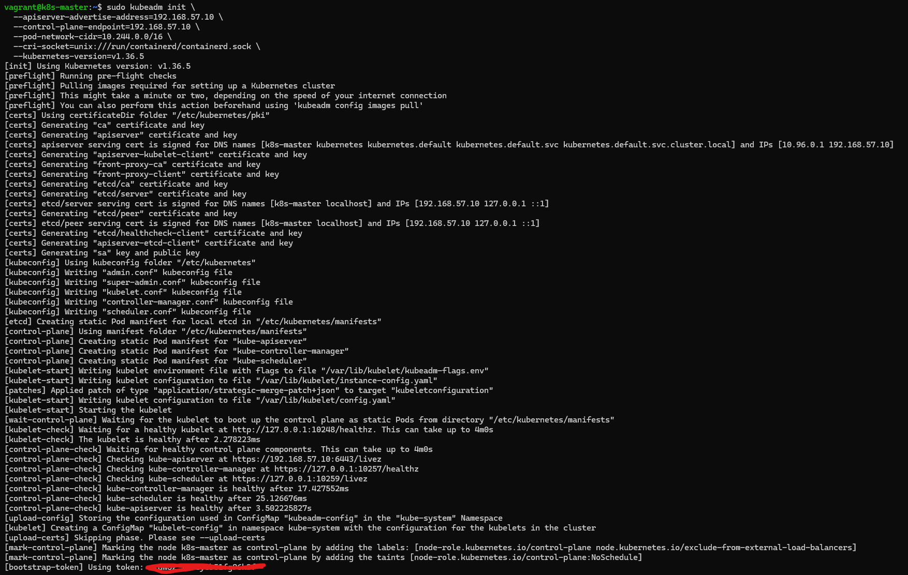

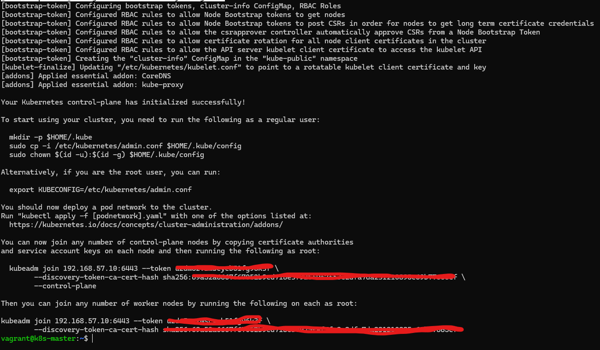

Приступим к настройке `kubectl`.
Предоставим пользователю `vagrant` возможность управлять кластером без `sudo`:

```
mkdir -p $HOME/.kube
sudo cp -i /etc/kubernetes/admin.conf $HOME/.kube/config
sudo chown $(id -u):$(id -g) $HOME/.kube/config
```

Проверим подключение к API Server:

```
kubectl cluster-info
```

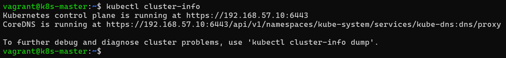

Посмотрим состояние узлов и системных Pod:

```
kubectl get nodes -o wide
kubectl get pods -n kube-system -o wide
```

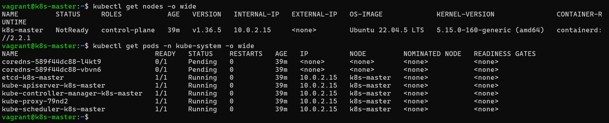

Исправим InternalIP на узле `k8s-master`:

```
echo 'KUBELET_EXTRA_ARGS="--node-ip=192.168.57.10"' \
  | sudo tee /etc/default/kubelet

sudo systemctl daemon-reload
sudo systemctl restart kubelet

kubectl get nodes -o wide
```

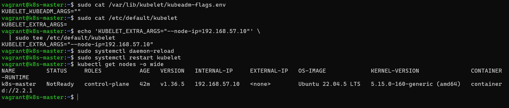

Автоматизируем настройку IP для всех узлов.
Создадим файл `configure-kubelet.sh` следующего содержания:

```
#!/usr/bin/env bash
set -euo pipefail

echo "=== Configuring kubelet node IP ==="

NODE_IP=$(ip -4 -o addr show dev eth1 | awk '{print $4}' | cut -d/ -f1)

if [[ -z "$NODE_IP" ]]; then
    echo "ERROR: Cannot determine IP address of eth1"
    exit 1
fi

echo "Detected node IP: $NODE_IP"

printf 'KUBELET_EXTRA_ARGS="--node-ip=%s"\n' "$NODE_IP" \
    > /etc/default/kubelet

systemctl daemon-reload
systemctl restart kubelet

echo "=== Kubelet configured successfully ==="
```

Добавим `provisioner` в `Vagrantfile`:

```
machine.vm.provision "shell",
  name: "configure-kubelet",
  path: "scripts/configure-kubelet.sh",
  privileged: true
```

Проверим конфигурацию:

```
vagrant validate
```

Применим новый `provisioner`:

```
$workers = @(
    "k8s-worker-1",
    "k8s-worker-2",
    "k8s-worker-3",
    "k8s-worker-4"
)

foreach ($worker in $workers) {
    Write-Host "`n===== $worker =====" -ForegroundColor Cyan
    vagrant provision $worker --provision-with configure-kubelet

    if ($LASTEXITCODE -ne 0) {
        Write-Host "ERROR: Provisioning failed for $worker" -ForegroundColor Red
        break
    }
}
```

Мы используем `--provision-with configure-kubelet`, поэтому Vagrant запустит только новый скрипт, а не повторит установку containerd и Kubernetes.

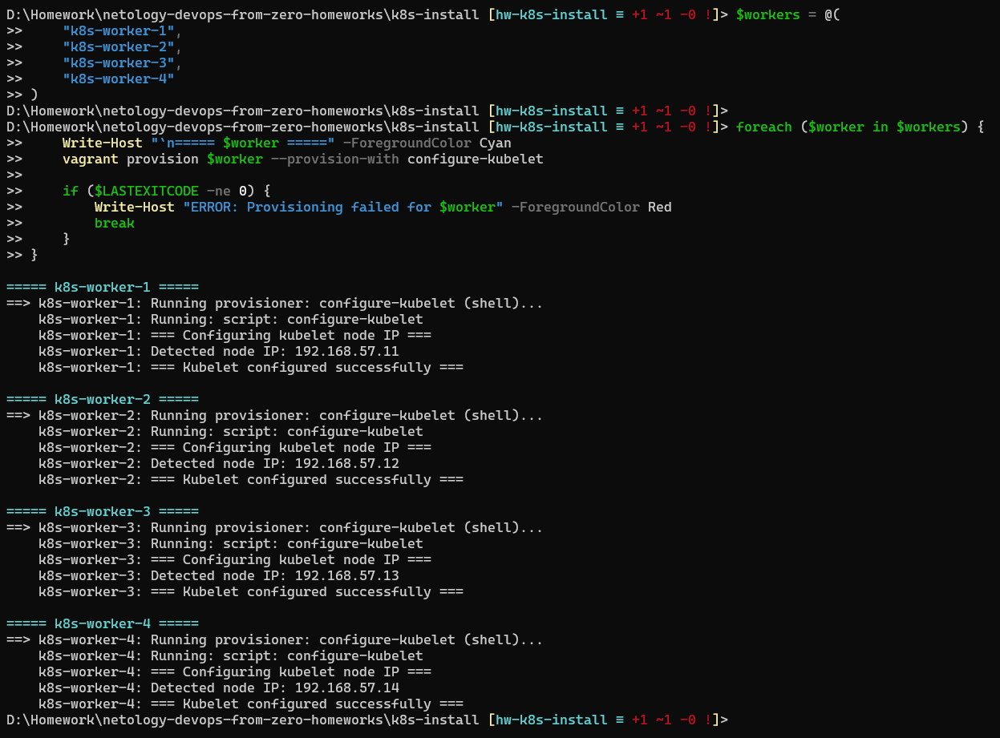

Проверим результат:

```
foreach ($worker in $workers) {
    Write-Host "`n===== $worker =====" -ForegroundColor Cyan

    vagrant ssh $worker -c 'cat /etc/default/kubelet; ip -4 -br addr show eth1'
}
```

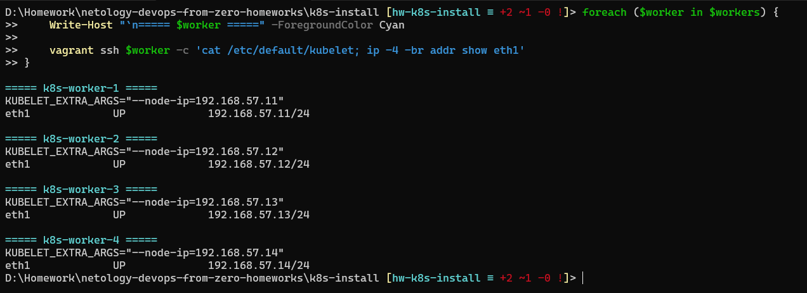

Приступим к установке сетевого плагина Flannel:

```
kubectl apply -f https://github.com/flannel-io/flannel/releases/latest/download/kube-flannel.yml
```

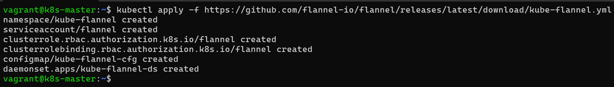

Проверим результат:

```
kubectl get pods -n kube-flannel -o wide

kubectl get nodes -o wide
kubectl get pods -n kube-system -o wide
```

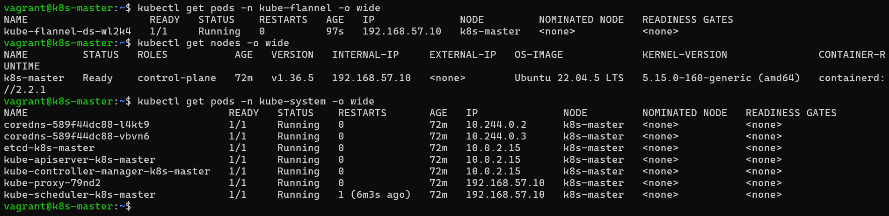

Приступим к подключению worker-узлов.
На виртуальной машине `k8s-master` выполним:

```
kubeadm token create --print-join-command
```

В выводе мы получим команду, которая используется для подключения worker-узлов к Control Plane.

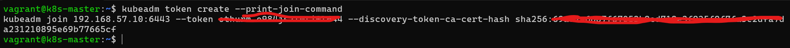

Подключим первый worker.
На виртуальной машине `k8s-worker-1` выполним команду, полученную на предыдущем шаге:

```
sudo kubeadm join 192.168.57.10:6443 \
  --token <TOKEN> \
  --discovery-token-ca-cert-hash sha256:<HASH>
```

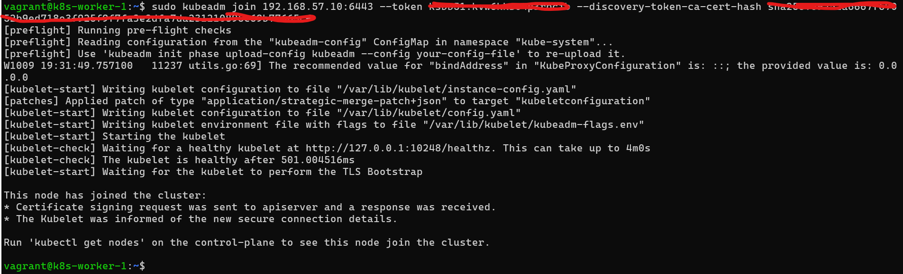

Проверим подключение на ноде `k8s-master`:

```
kubectl get nodes -o wide
kubectl get pods -n kube-flannel -o wide
```

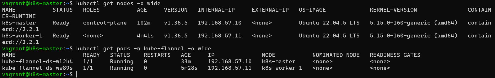

Для подключения оставшихся трёх worker-узлов выполним ту же самую команду для подключения на каждом из них.

После подключения всех worker-узлов проверим весь кластер.
На виртуальной машине `k8s-master` выполним:

```
kubectl get nodes -o wide
```

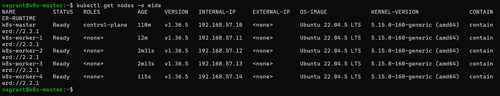

Проверим Flannel:

```
kubectl get pods -n kube-flannel -o wide
```

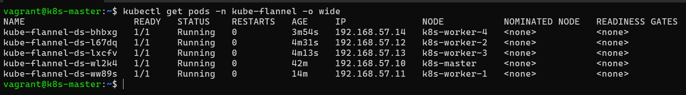

Проверим состояние системных компонентов Kubernetes.

На узле `k8s-master` выполним:

```
kubectl get nodes -o wide
kubectl get pods -n kube-system -o wide
```

В результате проверки установлено, что основные компоненты кластера работают:

- `etcd` запущен на узле `k8s-master`.
- `kube-apiserver`, `kube-controller-manager` и `kube-scheduler` работают на управляющем узле.
- Два экземпляра `CoreDNS` находятся в состоянии `Running`.
- `kube-proxy` запущен на всех пяти узлах.

Все системные Pod находятся в состоянии `Running`.

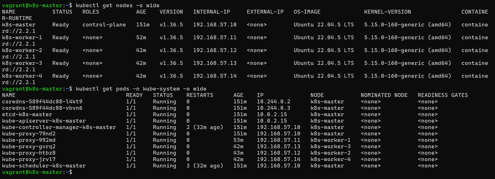

### Проверка работы Kubernetes Deployment

Для проверки работы кластера создадим Deployment с четырьмя репликами веб-сервера nginx.

На узле `k8s-master` выполним:

```
kubectl create deployment nginx-test --image=nginx:stable --replicas=4
```

Дождёмся завершения развёртывания:

```
kubectl rollout status deployment/nginx-test --timeout=180s
```

Проверим состояние Deployment и распределение Pod по узлам:

```
kubectl get deployment nginx-test
kubectl get pods -o wide
```

В результате все четыре реплики nginx успешно запущены и находятся в состоянии `Running`.

Kubernetes распределил Pod по четырём worker-узлам: `k8s-worker-1`, `k8s-worker-2`, `k8s-worker-3` и `k8s-worker-4`.

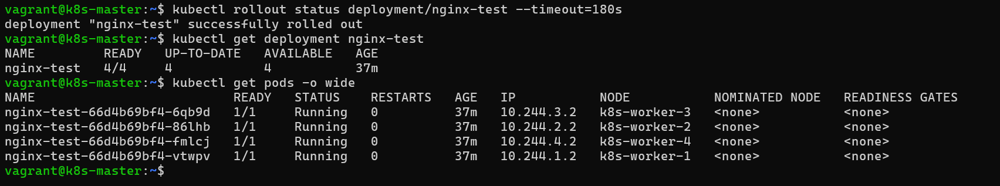


### Проверка межузлового сетевого взаимодействия и настройка Flannel

После запуска Deployment `nginx-test` проверим сетевое взаимодействие между Pod, расположенными на разных worker-узлах.

Выполним HTTP-запрос из Pod на `k8s-worker-1` к Pod с адресом `10.244.2.2`, работающему на `k8s-worker-2`:

```
kubectl exec nginx-test-66d4b69bf4-vtwpv -- \
  curl -I --max-time 10 http://10.244.2.2
```

Первоначально запрос завершился ошибкой `Could not connect to server`.

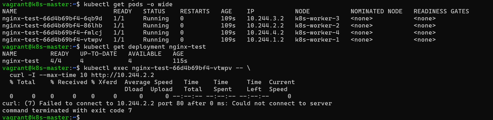

Для диагностики проверим IP-адреса, используемые Flannel:

```
kubectl get nodes \
  -o custom-columns='NAME:.metadata.name,FLANNEL-IP:.metadata.annotations.flannel\.alpha\.coreos\.com/public-ip'
```

Обнаружено, что Flannel на всех пяти узлах использует адрес `10.0.2.15`, принадлежащий интерфейсу `eth0` (NAT-интерфейс VirtualBox).

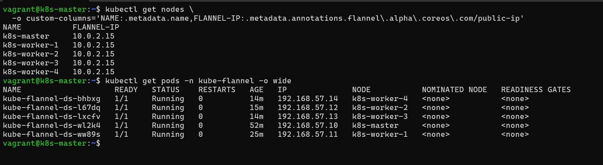

Поскольку все виртуальные машины имеют одинаковый адрес NAT-интерфейса, использование `eth0` не обеспечивает корректную межузловую VXLAN-связность.

Для обмена трафиком между узлами необходимо использовать интерфейс `eth1`, подключённый к сети VirtualBox Host-Only `192.168.57.0/24`.

Изменим конфигурацию DaemonSet Flannel:

```
kubectl edit daemonset kube-flannel-ds -n kube-flannel
```

В список аргументов контейнера `kube-flannel` добавим:

```
- --iface=eth1
```

Проверим, что параметр `--iface=eth1` присутствует
в конфигурации DaemonSet Flannel:

```
kubectl get daemonset kube-flannel-ds -n kube-flannel \
  -o jsonpath='{.spec.template.spec.containers[?(@.name=="kube-flannel")].args}'
echo
```

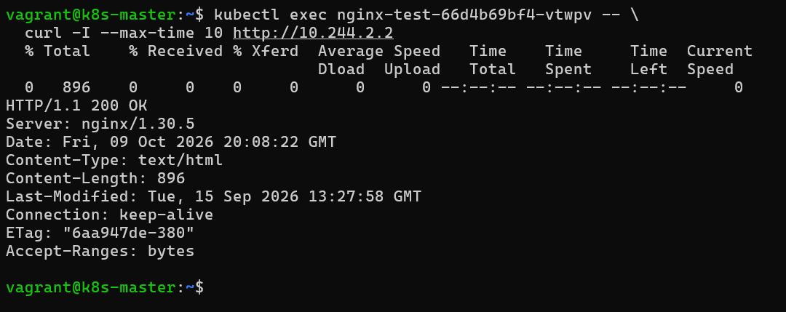

Дождёмся завершения обновления DaemonSet:

```
kubectl rollout status daemonset/kube-flannel-ds \
  -n kube-flannel --timeout=180s
```

Повторно проверим IP-адреса Flannel:

```
kubectl get nodes \
  -o custom-columns='NAME:.metadata.name,FLANNEL-IP:.metadata.annotations.flannel\.alpha\.coreos\.com/public-ip'
```

Теперь каждый узел использует собственный адрес из сети `192.168.57.0/24`.

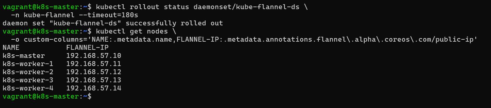

Повторим HTTP-запрос между Pod на разных worker-узлах:

```
kubectl exec nginx-test-66d4b69bf4-vtwpv -- \
  curl -I --max-time 10 http://10.244.2.2
```

В результате получен ответ:

```
HTTP/1.1 200 OK
Server: nginx/1.30.5
```

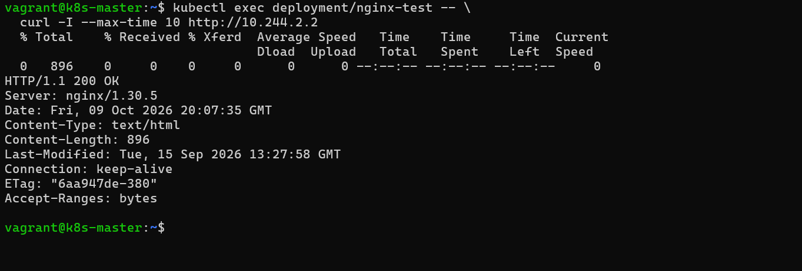

Таким образом, подтверждена работоспособность межузлового сетевого взаимодействия Kubernetes через Flannel VXLAN.

Для сохранения воспроизводимой конфигурации в репозиторий добавлен манифест `kube-flannel.yml` версии `v0.28.10` с параметром `--iface=eth1`.

Для проверки сохранённого манифеста загрузим файл `kube-flannel.yml` с локального компьютера на управляющий узел `k8s-master`.

В PowerShell, находясь в каталоге `k8s-install`, выполним:

```
vagrant upload .\manifests\kube-flannel.yml /tmp/kube-flannel.yml k8s-master
```

После успешной загрузки проверим манифест с помощью Kubernetes API. Для этого выполним на управляющем узле `k8s-master`:

```
kubectl apply --dry-run=server -f /tmp/kube-flannel.yml
```

Параметр `--dry-run=server` позволяет проверить обработку манифеста сервером Kubernetes API без сохранения изменений в кластере.

Проверка завершилась успешно, без ошибок валидации.

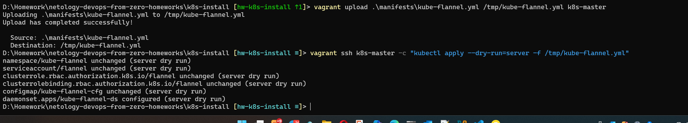


## Ссылки на файлы

- [Vagrantfile — конфигурация пяти виртуальных машин](k8s-install/Vagrantfile)
- [prepare-nodes.sh — подготовка узлов Kubernetes](k8s-install/scripts/prepare-nodes.sh)
- [install-containerd.sh — установка containerd](k8s-install/scripts/install-containerd.sh)
- [install-kubernetes.sh — установка компонентов Kubernetes](k8s-install/scripts/install-kubernetes.sh)
- [configure-kubelet.sh — настройка IP-адреса kubelet](k8s-install/scripts/configure-kubelet.sh)
- [kube-flannel.yml — конфигурация сетевого плагина Flannel](k8s-install/manifests/kube-flannel.yml)